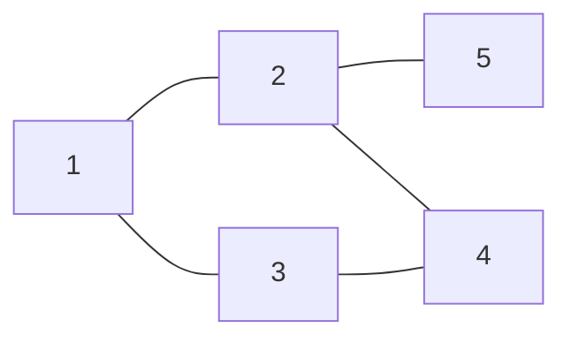
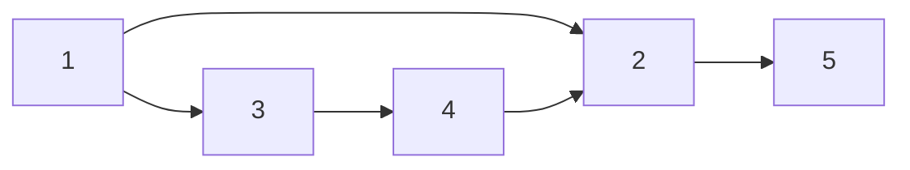
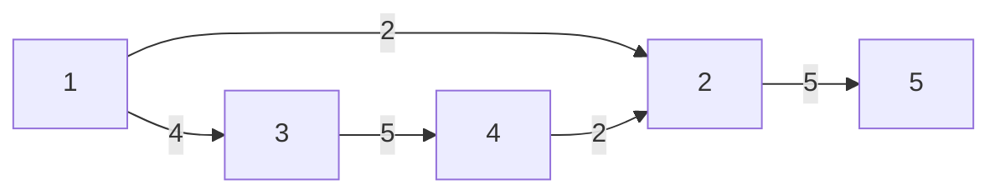
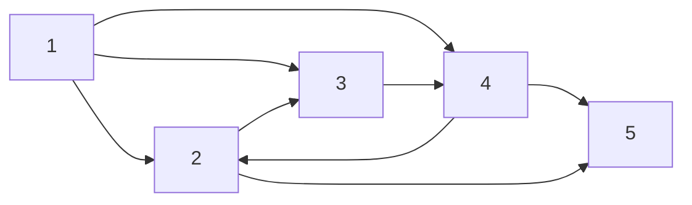
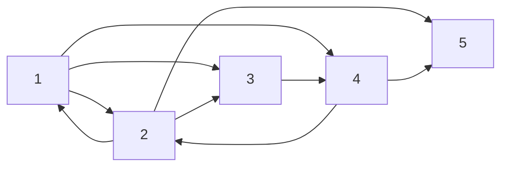

# 🟨 자바스크립트 알고리즘 문제풀이 

<br>

## 📀 [인프런 - 자바스크립트 알고리즘 문제풀이 by 김태원 ](https://www.inflearn.com/course/%EC%9E%90%EB%B0%94%EC%8A%A4%ED%81%AC%EB%A6%BD%ED%8A%B8-%EC%95%8C%EA%B3%A0%EB%A6%AC%EC%A6%98-%EB%AC%B8%EC%A0%9C%ED%92%80%EC%9D%B4)

<br>

<details> 
<summary>챕터1 - 기본풀이 문제</summary>


<br>

<details>
<summary>1_1 세 수 중 최솟값</summary>
<div markdown="1">       
<br>
 
 ### ❓ Question
 
 <pre>  100이하의 자연수 A, B, C를 입력받아 세 수 중 가장 작은 값을 출력하는 프로그램을 작성하 세요.(정렬을 사용하면 안됩니다) </pre>
 
 <br>
 
 ### ‼️ Solution 
 
 ```javascript
 function solution(a, b, c) {
    let answer;
    if (a < b) 
        answer = a;
    else 
        answer = b;
    if (c < answer) 
        answer = c;
    return answer;
}

console.log(solution(2, 5, 1));
 ```
 
 <br>
 
 ### ⁉️ Alternative Solution
 
  ```javascript
 function solution(a, b, c) {
    let temp = [a,b,c]
    let answer = Math.max.apply(null, temp)
    let answer2 = Math.max(...temp)

    console.log(answer)
    console.log(answer2)
}

solution(2, 5, 1)
```

 <pre>
 1. 선생님은 일단 if 문으로 간단하게 끝내셨다.
 2. 나는 Math.max를 사용하여서 값을 뽑고싶었고, 하지만 해당 메소드는 배열로 출력하면 
    NaN(Not a Number)가 출력되기 때문에 알아보니 전개연산자<Spread Operator>나 apply 메소드
    를 통해서 배열 파라미터를 전할 수 있었다.
 </pre>

</div>
</details>
 
 <details>
<summary>1_2 삼각형 판별하기</summary>
<div markdown="1">       
<br>
 
 ### ❓ Question
 
 <pre>  1길이가 서로 다른 A, B, C 세 개의 막대 길이가 주어지면 이 세 막대로 삼각형을 만들 수 있으면 
 “YES"를 출력하고, 만들 수 없으면 ”NO"를 출력한다. </pre>
 
 <br>
 
 ### ‼️ Solution
 
 ```javascript
 function solution(a, b, c) {
    let answer = "YES",
        max;
    let tot = a + b + c;
    if (a > b) 
        max = a;
    else 
        max = b;
    if (c > max) 
        max = c;
    if (tot - max <= max) 
        answer = "NO";
    return answer;
}

console.log(solution(13, 33, 17));
 ```
 
 <br>
 
 <pre>
 💬 일단 짚고 넘어가야 할 것은, 제일 긴변은 나머지 두 선의 합보다 작아서는 
    안되는 것입니다. 그렇기 때문에 if문으로 입력값 3개 중 최댓값을 구한 후, 
    sum값에서 max를 빼고, 그 값이 max 값보다 작으면 삼각형이 될 수 없다.
 </pre>

</div>
</details>
 
 <details>
<summary>1_3 연필 개수</summary>
<div markdown="1">       
<br>
 
 ### ❓ Question
 
 <pre>  연필 1 다스는 12자루입니다. 학생 1인당 연필을 1자루씩 나누어 준다고 
 할 때 N명이 학생수 를 입력하면 필요한 연필의 다스 수를 계산하는 프로그램을 작성하세요. </pre>
 
 <br>
 
 ### ‼️ Solution
 
 ```javascript
function solution(n) 
{
    let answer;
    answer = Math.ceil(n / 12);
    return answer;
}

console.log(solution(178));
 ```
 
 <br>
 
 <pre>
 💬 Math.ceil() 메소드만 알면 굉장히 간단한 문제였다. 한 다스에 12개,
    즉 입력을 12로 나누고, 나머지 값을 무조건 반올림해주면 되는 문제다.

    여기서 추가로 Math.float()는 반대로 무조건 내림값을 출력 
               Math.round()는 0.5이상은 반올림해주는 메소드. 
 </pre>

</div>
</details>
 
 <details>
<summary>1_4 1부터 N까지 합 출력하기</summary>
<div markdown="1">       
<br>
 
 ### ❓ Question
 
 <pre>  자연수 N이 입력되면 1부터 N까지의 합을 출력하는 프로그램을 작성하세요.
 </pre>
 
 <br>
 
 ### ‼️ Solution
 
 ```javascript
function solution(n) {
    let answer = 0;
    for (let i = 1; i <= n; i++) {
        answer = answer + i;
    }

    return answer;
}

console.log(solution(10));
 ```
 
 <br>
 
 ### ⁉️ Alternative Solution
 
  ```javascript
 function solution(arr){
  let answer = 0;
  let answer2 = 0;
  answer = arr.reduce((accumulator, curr) => accumulator + curr)
  arr.forEach(function(el){answer2+=el});
  
  console.log(answer2)
  return answer, 
}
arr = [1,2,3,4,5,6]
console.log(solution(arr));
```

 <pre>
 💬 배열이아닌 파라미터가 숫자하나인 입력값을 받을때 제일 단순한 방법은 
    for문으로 누적합을 구하는 것 같고 배열일때 누적합을 구하는 것도 for문
    사용을 할 수 있지만 reduce() 메소드나 forEach() 메소드로 구할 수 있다.
 </pre>

</div>
</details>

<details>
<summary>1_5 최솟값 구하기</summary>
<div markdown="1">       
<br>
 
 ### ❓ Question
 
 <pre>  7개의 수가 주어지면 그 숫자 중 가장 작은 수를 출력하는 프로그램을 작성하세요.
 </pre>
 
 <br>
 
 ### ‼️ Solution
 
 ```javascript
function solution(arr) {
    let answer,
    let min = Number.MAX_SAFE_INTEGER;
    for (let i = 1; i < arr.length; i++) {
        if (arr[i] < min) 
            min = arr[i];
        }
    answer = min;
    return answer;

}
let arr = [5,7,1,3,2,9,11];
console.log(solution(arr));
 ```
 
 <br>
 
 ### ⁉️ Alternative Solution
 
  ```javascript
 function solution(arr){
  answer = Math.min(...arr);
  return answer;
}
let arr=[5,7,1,3,2,9,11]
console.log(solution(arr));
```

 <pre>
 💬 선생님의 첫번 째 솔루션은 최솟값을 넣을 변수에 MAX_SAFE_INTEGER로 초기화
    하고, for문으로 돌리면서 그 변수와 if문으로 비교하며, 더 작으면 그 변수값에 
    최솟값을 넣는 방식이고, 대체 솔루션은 Math.min()메소드를 사용하는 건데, 
    해당 메소드는 배열을 넣으면 NaN이 나오게된다. 그래서 전개 연산자를 사용해주면
    인식하여, 정상작동하는 것을 볼 수 있다. 
 </pre>

</div>
</details>
 
 <details>
<summary>1_6 홀 수</summary>
<div markdown="1">       
<br>
 
 ### ❓ Question
 
 <pre>  7개의 자연수가 주어질 때, 이들 중 홀수인 자연수들을 모두 골라 그 합을 구하고, 고른 홀수들 중 최소값을 찾는 프로그램을 작성하세요.
 </pre>
 
 <br>
 
 ### ‼️ Solution
 
 ```javascript
function solution(nat_num){
  let answer = [], sum =0, min = Number.MAX_SAFE_INTEGER;
  for (let i =0;i<nat_num.length;i++)
  {
      if((nat_num[i]%2)!==0){
          sum += nat_num[i];
          if (nat_num[i] < min) min = nat_num[i];
      }
  }   
  answer.push(sum);
  answer.push(min);
  return answer;
}
nat_num = [12,77,38,41,53,92,85]
console.log(solution(nat_num));
 ```
 
 <br>
 
 
 <pre>
 💬 7개의 자연수중에 홀수만 골라 출력하는거니, 일단 변수 answer를 리스트로
    초기화해주고 if문으로 홀수를 골라준다음에 또 다른 if문으로 최솟값이 나올때마다
    최소 변수에 그 값을 넣어주고, push() 메소드로 answer에 넣어준다. 
 </pre>

</div>
</details>

 <details>
<summary>1_7 10부제</summary>
<div markdown="1">       
<br>
 
 ### ❓ Question
 
 <pre>  서울시는 6월 1일부터 교통 혼잡을 막기 위해서 자동차 10부제를 시행한다. 자동차 10부제는 자동차 번호의 일의 자리 숫자와 
 <br>   날짜의 일의 자리 숫자가 일치하면 해당 자동차의 운행을 금 지하는 것이다. 예를 들어, 자동차 번호의 일의 자리 숫자가 7이면 7일,
 <br>   17일, 27일에 운행하 지 못한다. 또한, 자동차 번호의 일의 자리 숫자가 0이면 10일, 20일, 30일에 운행하지 못한 다.
 <br>
   여러분들은 일일 경찰관이 되어 10부제를 위반하는 자동차의 대수를 세는 봉사활동을 하려고 한다. 날짜의 일의 자리 숫자가 주어지고 
<br>   7대의 자동차 번호의 끝 두 자리 수가 주어졌을 때 위반하는 자동차의 대수를 출력하는 프로그램을 작성하세요.
 </pre>
 
 <br>
 
 ### ‼️ Solution
 
 ```javascript
function solution(day, arr) {
    let answer = 0;
    for (let x of arr) {
        if (x % 10 == day) 
            answer++;
        }
    
    return answer;
}
arr=[25, 23, 11, 47, 53, 17, 33];
console.log(solution(3, arr));
 ```
 
 <br>
 
 <pre>
 💬  십의 자리의 숫자들을 일단 10으로 나머지 연산을 하면 1의 자리만 남겠고 그것을 날짜의 일의 자리와 
     if문으로 비교해서 걸리면 하나씩 카운트하게끔 하면 된다. 
 </pre>

</div>
</details>

 <details>
<summary>1_8 일곱 난쟁이</summary>
<div markdown="1">       
<br>
 
 ### ❓ Question
 
 <pre> 왕비를 피해 일곱 난쟁이들과 함께 평화롭게 생활하고 있던 백설공주에게 위기가 찾아왔다. 일과를 마치고 돌아온 난쟁이가 
 <br> 일곱 명이 아닌 아홉 명이었던 것이다. 아홉 명의 난쟁이는 모두 자신이 "백설 공주와 일곱 난쟁이"의 주인공이라고 주장했다. 
 <br> 뛰어난 수학적 직관력을 가지고 있던 백설공주는, 다행스럽게도 일곱 난쟁이의 키의 합이 100이 됨을 기억해 냈다.
<br> 아홉 난쟁이의 키가 주어졌을 때, 백설공주를 도와 일곱 난쟁이를 찾는 프로그램을 작성하시오.
 </pre>
 
 <br>
 
 ### ‼️ Solution
 
 ```javascript
function solution(arr){
  let answer=arr;
  let sum=answer.reduce((a, b)=>a+b, 0);
  for(let i=0; i<8; i++){
      for(let j=i+1; j<9; j++){
          if((sum-(answer[i]+answer[j]))==100){
              answer.splice(j, 1);
              answer.splice(i, 1);
          }
      }
  }
  return answer;
}
let arr=[20, 7, 23, 19, 10, 15, 25, 8, 13];
console.log(solution(arr));
 ```
 
 <br>

 <pre>
 💬  일단 모든 파라미터를 더해서 누적합을 구한다. 그리고 이중 for문으로 인덱스 i, j 번째 파라미터 둘을 더하고,
     누적합에서 빼서 100이 나오면 해당 인덱스에 파라미터를 splice()메소드로 제외시키는데 여기서, 뒤에 있는 인덱스
     j를 먼저 제외시켜주는데 이유는 인덱스를 삭제하면, 뒤에 있던 인덱스가 앞으로 당겨지기 때문이다. 
 </pre>

</div>
</details>
 
 <details>
<summary>1_9 A를 #으로</summary>
<div markdown="1">       
<br>
 
 ### ❓ Question
 
 <pre>대문자로 이루어진 영어단어가 입력되면 단어에 포함된 ‘A'를 모두 ’#‘으로 바꾸어 출력하는 프로그램을 작성하세요.
 </pre>
 
 <br>
 
 ### ‼️ Solution
 
 ```javascript
function solution(s) {
    let answer = "";
    for (let x of s) {
        if (x == 'A') 
            answer += '#';
        else 
            answer += x;
        }
    return answer;
}
let str="BANANA";
console.log(solution(str));
 ```
 
 <br>

  ### ⁉️ Alternative Solution
 
  ```javascript
function solution(s) {
    let answer = s;
    answer = answer.replace(/A/g, "#");
    return answer;
}
=let str="BANANA";
console.log(solution(str));
```

 <br>
 
 <pre>
 💬  일단 솔루션은 간단하다, for of 로 문자열을 하나씩 가져오고 'A'와 대조해 같으면 #으로 넣어주는거다.
     대안 솔루션은 replace() 라는 메소드를 사용하게 되는데, 여기서는 global을 붙여줌으로써 모든 문자열에 
     영향을 끼치게 한다. 
 </pre>
 
  참조 링크: [replace()-MDN][ref-mdn]
 
[ref-mdn]: https://developer.mozilla.org/ko/docs/Web/JavaScript/Reference/Global_Objects/String/replace "ref-replace()"
 
</div>
</details>
 
<details>
<summary>1_10 문자 찾기</summary>
<div markdown="1">       
<br>
 
 ### ❓ Question
 
 <pre>한 개의 문자열을 입력받고, 특정 문자를 입력받아 해당 특정문자가 입력받은 문자열에 몇 개 존재하는지 알아내는 프로그램을 작성하세요.
 </pre>
 
 <br>
 
 ### ‼️ Solution
 
 ```javascript
function solution(s, t){
  let answer=0;
  for(let x of s){
      if(x===t) answer++;
  }
  return answer;
}

let str="COMPUTERPROGRAMMING";
console.log(solution(str, 'R'));
 ```
 
 <br>

  ### ⁉️ Alternative Solution
 
  ```javascript
function solution(s, t) {
    let answer = s.split(t).length;
    return answer - 1;
}
let str="COMPUTERPROGRAMMING";
console.log(solution(str, 'R'));
```

<br> 
 
 <pre>
 💬  솔루션은 for of로 문자열의 문자를 하나씩 가져오고 비교하여 카운트를 하는 것이고 
     다른 방법으로는 문자열을 내가 찾아야하는 문자로 split()하여 바로 length()로
     파라미터를 카운트해주고 마지막에 -1를 한다.
 </pre>

</div>
</details>
 
<details>
<summary>1_11 대문자 찾기</summary>
<div markdown="1">       
<br>
 
 ### ❓ Question
 
 <pre>한 개의 문자열을 입력받아 해당 문자열에 알파벳 대문자가 몇 개 있는지 알아내는 프로그램 을 작성하세요.
 </pre>
 
 <br>
 
 ### ‼️ Solution
 
 ```javascript
function solution(s) {
    let answer = 0;
    for (let x of s) {
        if (x === x.toUpperCase()) 
            answer++;
        }    
    return answer;
}
let str="KoreaTimeGood";
console.log(solution(str));
 ```
 
 <br>

  ### ⁉️ Alternative Solution
 
  ```javascript
function solution(s) {
    let answer = 0;
    for (let x of s) 
    {
      let num=x.charCodeAt(); 
      if(num>=65 && num<=90) answer++;
    }
    
    return answer;
}
let str="KoreaTimeGood";
console.log(solution(str));
```

 <br>

 <pre>
 💬  첫번쨰 솔루션은 toUpperCase()메소드로 문자열을 대문자로 전부 바꿔주고, 기존 문자열과
     비교하여 카운트를하는 방법과, 다른 방법으로는 charCodeAt() 메소드로 for of로 돌려
     해당 문자열 인덱스에 해당되는 문자를 유니코드로 바꿔서 대문자 유니코드의 범주안에 들어가있으면
     카운트하는건데, 기억해둘건 대문자(65~90) / 소문자(97~122)     
 </pre>

</div>
</details>
 
<details>
<summary>1_12 대문자로 통일</summary>
<div markdown="1">       
<br>
 
 ### ❓ Question
 
 <pre>한 개의 문자열을 입력받아 해당 문자열에 알파벳 대문자가 몇 개 있는지 알아내는 프로그램 을 작성하세요.
 </pre>
 
 <br>
 
 ### ‼️ Solution
 
 ```javascript
function solution(s){         
let answer = "";
for (let x of s) {
    let num = x.charCodeAt();
    if (num >= 97 && num <= 122) 
        answer += String.fromCharCode(num - 32);
    else 
        answer += x;       
    }
return answer;
}
let str="ItisTimeToStudy";
console.log(solution(str));
 ```
 
 <br>

  ### ⁉️ Alternative Solution
 
  ```javascript
function solution(s){         
  let answer="";
  for(let x of s){
      if(x===x.toLowerCase()) answer+=x.toUpperCase();
      else answer+=x;
  }
  return answer;
}
let str="ItisTimeToStudy";
console.log(solution(str));
```

 <br>

 <pre>
 💬  첫번째 솔루션은 for of 돌리면서, 문자열 인덱스마다 문자를 유니코드를 바꾸어서 소문자 범주안에 들어있다면,
     대문자 유니코드로 바꿔준다, 알파벳마다 32씩 차이나서 fromCharCode(num-32) 이렇게 넣어준다. 
     다른 방법으로는 if에 toLowerCase()메소드를 사용해서 비교하고 소문자면 toUpperCase()로 바꿔준다. 
 </pre>

</div>
</details>

 <details>
<summary>1_13 대소문자 변환</summary>
<div markdown="1">       
<br>
 
 ### ❓ Question
 
 <pre>대문자와 소문자가 같이 존재하는 문자열을 입력받아 대문자는 소문자로 소문자는 대문자로 변환하여 출력하는 프로그램을 작성하세요.
 </pre>
 
 <br>
 
 ### ‼️ Solution
 
 ```javascript
function solution(s){  
  let answer="";
  for(let x of s){
      if(x===x.toUpperCase()) answer+=x.toLowerCase();
      else answer+=x.toUpperCase();
  }
  return answer;
}
console.log(solution("StuDY"));
 ```
 
 <br>

 <br>

 <pre>
 💬  간단하다, if문 toUpperCase()로 바꿔주고 비교해서 맞다면 소문자로 아니면 대문자로 바꿔준다. 
 </pre>

</div>
</details>

<details>
<summary>1_14 가장 긴 문자열</summary>
<div markdown="1">       
<br>
 
 ### ❓ Question
 
 <pre>N개의 문자열이 입력되면 그 중 가장 긴 문자열을 출력하는 프로그램을 작성하세요.
 </pre>
 
 <br>
 
 ### ‼️ Solution
 
 ```javascript
function solution(s) {
    let answer = "",
        max = Number.MIN_SAFE_INTEGER;
    for (let x of s) {
        if (x.length > max) {
            max = x.length;
            answer = x;
        }
    }
    return answer;
}
let str=["teacher", "time", "student", "beautiful", "good"];
console.log(solution(str));
 ```
 
 <br>

 <br>

 <pre>
 💬  최대값 변수에 Number.MIN_SAFE_INTEGER 상수를 넣어주고, for of로 인덱스마다 문자열가져와서 
     length()로 길이를 비교를 해서 제일 큰걸 answer 변수에 넣어서 출력
 </pre>

</div>
</details>

<details>
<summary>1_15 가운데 문자 출력</summary>
<div markdown="1">       
<br>
 
 ### ❓ Question
 
 <pre>소문자로 된 단어(문자열)가 입력되면 그 단어의 가운데 문자를 출력하는 프로그램을 작성하세 요. 단 단어의 길이가 짝수일 경우 가운데 2개의 문자를 출력합니다.
 </pre>
 
 <br>
 
 ### ‼️ Solution
 
 ```javascript
function solution(s) {
    let answer;
    let mid = Math.floor(s.length / 2)
    if (s.length % 2 === 1) 
        answer = s.substring(mid, mid + 1);
    else 
        answer = s.substring(mid - 1, mid + 1);
    return answer;
}
console.log(solution("study"));
 ```
 
 <br>


 ### ⁉️ Alternative Solution
 
  ```javascript
function solution(s){  
  let answer;
  let mid=Math.floor(s.length/2)
  if(s.length%2===1) answer=s.substr(mid, 1);
  else answer=s.substr(mid-1, 2);
  return answer;
}
console.log(solution("abcef"));
```

 <br>

 <pre>
 💬  첫 번째 솔루션은 mid라는 변수를 하나 만들고, 문자열 가운데 인덱스를 잡을 수 있게 값을 넣어줍니다. 
     그래서 홀수, 짝수에 따라, substring() 메소드를 이용해서 해당 인덱스에 해당되는 문자를 answer에 넣어준다.
     다른 방법은 substr() 메소드인데, 차이점이라고 한다면 두번째 파라미터에 들어간 값의 인덱스까지 출력한다. 
     substring()은 두번째 파라미터값의 전 인덱스까지 반환한다. 
 </pre>

 참조 - [substring()](https://developer.mozilla.org/ko/docs/Web/JavaScript/Reference/Global_Objects/String/substring), [substr()](https://developer.mozilla.org/ko/docs/Web/JavaScript/Reference/Global_Objects/String/substr)

</div>
</details>
 
 <details>
<summary>1_16 중복문자제거</summary>
<div markdown="1">       
<br>
 
 ### ❓ Question
 
 <pre>소문자로 된 한개의 문자열이 입력되면 중복된 문자를 제거하고 출력하는 프로그램을 작성하 세요.<br>
      제거된 문자열의 각 문자는 원래 문자열의 순서를 유지합니다.
 </pre>
 
 <br>
 
 ### ‼️ Solution
 
 ```javascript
function solution(s){  
let answer = "";
//console.log(s.indexOf("K"));
for (let i = 0; i < s.length; i++) {
    //console.log(s[i], i, s.indexOf(s[i]));
    if (s.indexOf(s[i]) === i) 
        answer += s[i];
    }
return answer;
}
console.log(solution("ksekkset"));
 ```
 
 <br>

 <br>

 <pre>
 💬  솔루션은 indexOf()라는 메소드로,  문자열 s[i]번째 인덱스에 해당되는 문자의 인덱스 번호랑 for문으로 돌리는 i랑 비교해서
     그 값이 같은 문자만 answer에 넣는다. 왜냐하면 indexOf에서 같은 문자라도 문자열에서 첫번째로 나오는 인덱스 번호만 나오기때문에
     중복값이라면 두 값이 같을 수 없다.    
 </pre>

 참조 - [indexOf()](https://developer.mozilla.org/ko/docs/Web/JavaScript/Reference/Global_Objects/Array/indexOf)
</div>
</details>

 <details>
<summary>1_17 중복단어제거</summary>
<div markdown="1">       
<br>
 
 ### ❓ Question
 
 <pre>N개의 문자열이 입력되면 중복된 문자열은 제거하고 출력하는 프로그램을 작성하세요. <br>
      출력하는 문자열은 원래의 입력순서를 유지합니다.

 </pre>
 
 <br>
 
 ### ‼️ Solution
 
 ```javascript
function solution(s){  
  let answer;
  answer=s.filter((v, i)=>{
      if(s.indexOf(v)===i) return v;
  });
  return answer;
}
let str=["good", "time", "good", "time", "student"];
console.log(solution(str));
 ```
 
 <br>

 <br>

 <pre>
 💬  filter() 메소드를 이용해서 콜백함수가 통과하는 모든 요소를 모아 새로운 배열로 반환하는데, 
     v 즉 indexOf(v)로 해당 단어의 인덱스를 뽑아서 i와 비교해서 같다면 넣고 틀리다면 그냥 넘어가는 
     식으로 중복 문자를 제거한다. 
 </pre>

 참조 - [indexOf()](https://developer.mozilla.org/ko/docs/Web/JavaScript/Reference/Global_Objects/Array/indexOf)
</div>
</details>

</details>

<br>

<details>
<summary>챕터2 - 2차원 배열 탐색</summary>
 
<br> 
 
 <details>
<summary>2_1 큰 수 출력하기</summary>
<div markdown="1">       
<br>
 
 ### ❓ Question
 
 <pre>N(1<=N<=100)개의 정수를 입력받아, 자신의 바로 앞 수보다 큰 수만 출력하는 프로그램을 작 성하세요.<br>
      (첫 번째 수는 무조건 출력한다)
 </pre>
 
 <br>
 
 ### ‼️ Solution
 
 ```javascript
function solution(arr){         
  let answer=[];
  answer.push(arr[0]);
  for(let i=1; i<arr.length; i++){
      if(arr[i]>arr[i-1]) answer.push(arr[i]);
  }
  return answer;
} 
let arr=[7, 3, 9, 5, 6, 12]
console.log(solution(arr))
 ```
 
 <br>

 <br>

 <pre>
 💬  일단 answer를 데이터 타입을 리스트로 초기화해주고, 배열의 0번 인덱스를 push해서 넣습니다.
     그리고 for문을 돌려 현재 i 번째가 앞 인덱스보다 크다면 하나씩 push할 수 있도록 하였습니다. 
 </pre>

 참조 - [push()](https://developer.mozilla.org/ko/docs/Web/JavaScript/Reference/Global_Objects/Array/push)
</div>
</details>
  
  <details>
<summary>2_2 보이는 학생</summary>
<div markdown="1">       
<br>
 
 ### ❓ Question
 
  <pre>선생님이 N(1<=N<=1000)명의 학생을 일렬로 세웠습니다. 일렬로 서 있는 학생의 키가 앞에 서부터 순서대로 주어질 때,<br>맨 앞에 서 있는 선생님이 볼 수 있는 학생의 수를 구하는 프로그 램을 작성하세요. (앞에 서 있는 사람들보다 크면 보이고,<br>작거나 같으면 보이지 않습니다.)
 </pre>
 
 <br>
 
 ### ‼️ Solution
 
 ```javascript
function solution(arr){         
  let answer=1, max=arr[0];
  for(let i=1; i<arr.length; i++){
      if(arr[i]>max){
          answer++;
          max=arr[i];
      }
  }
  return answer;
}
let arr=[130, 135, 148, 140, 145, 150, 150, 153];
console.log(solution(arr));
 ```
 
 <br>

 <br>

 <pre>
 💬  너무 쉬운 문제였는데, 일단 맨앞에 있는 학생은 무조건 보이므로 answer 변수는 1로 초기화하고, 
    최댓값 max 변수를 [0]번 인덱스로 초기화 후 for문으로 돌리면서 [i]번째 인덱스가 최댓값보다 크면,
    answer++, 그리고 해당 인덱스를 max변수에 치환시킨다. 
 </pre>

</div>
</details>

<details>
<summary>2_3 가위 바위 보</summary>
<div markdown="1">       
<br>
 
 ### ❓ Question
 
 <pre>A, B 두 사람이 가위바위보 게임을 합니다. 총 N번의 게임을 하여 A가 이기면 A를 출력하고, B가 이기면 B를 출력합니다.<br>
 비길 경우에는 D를 출력합니다. 가위, 바위, 보의 정보는 1:가위, 2:바위, 3:보로 정하겠습니다.<br>
 두 사람의 각 회의 가위, 바위, 보 정보가 주어지면 각 회를 누가 이겼는지 출력하는 프로그램 을 작성하세요.
 </pre>

 <bt>

 |회수|A|B|승자|
|:---:|:---:|:---:|:---:|
|1|2|1|A|
|2|3|1|B|
|3|3|2|A|
|4|1|2|B|
|5|3|3|D|

 
 <br>
 
 ### ‼️ Solution
 
 ```javascript
function solution(a, b) {
    let answer = "";
    for (let i = 0; i < a.length; i++) {
        if (a[i] === b[i]) 
            answer += "D ";
        else if (a[i] === 1 && b[i] === 3) 
            answer += "A ";
        else if (a[i] === 2 && b[i] === 1) 
            answer += "A ";
        else if (a[i] === 3 && b[i] === 2) 
            answer += "A ";
        else 
            answer += "B ";
        }
    return answer;
}
let a=[2, 3, 3, 1, 3];
let b=[1, 1, 2, 2, 3];
console.log(solution(a, b));
 ```
 
 <br>

 <br>

 <pre>
 💬  가위바위보인 건데, if문으로 A가 이기는 경우를 다 else if로 적어놓고, 처음 if에는 무승부인 경우
     else는 다 B를 반환하게한다. 
 </pre>


</div>
</details>
 
 <details>
<summary>2_4 점수계산</summary>
<div markdown="1">       
<br>
 
 ### ❓ Question
 
 <pre>시험문제의 채점 결과가 주어졌을 때, 총 점수를 계산하는 프로그램을 작성하시오.
 </pre>

<br>

|채점|점수|
|---|---|
|1|1|
|0|0|
|1|1|
|1|2|
|1|3|
|0|0|
|0|0|
|1|1|
|1|2|
|0|0|

 <br>
 
 ### ‼️ Solution
 
 ```javascript
function solution(s){
  let answer = 0;
  let score = 1;
  for (let i=0;i<s.length;i++){
    if (s[i] == 1)
    {
      answer+=score;
      score++;
    }else{
      score = 1;
    }
  }
  return answer;
}
let str = [1,0,1,1,1,0,0,1,1,0];
console.log(solution(str));
 ```


 <br>

 <pre>
 💬  for문으로 인덱스가져오고, if로 비교해서 채점이 1이면 score변수로 더하고 score++,
    그 다음 인덱스에서도 채점이 1이면 더해진 score로 다시 더하고 아니라면 score, 1로 초기화한다. 
 </pre>


</div>
</details>
 
<details>
<summary>2_5 등수구하기</summary>
<div markdown="1">       
<br>
 
 ### ❓ Question
 
 <pre>N(1<=N<=100)명의 학생의 국어점수가 입력되면 각 학생의 등수를 입력된 순서대로 출력하는 프로그램을 작성하세요.
 </pre>

<br>
 
 ### ‼️ Solution
 
 ```javascript
function solution(s){
    let answer = [];
    let rank = s.length;
    for(let i = 0; i<s.length; i++){
      for(let j = 0;j<s.length; j++ ){
        if ( s[i] > s[j]){
          rank--;
        }
      }
      answer.push(rank);
      rank = 5;
    }
  return answer;
}
let str = [65,90,38,99,53];
console.log(solution(str));
 ```


 <br>

 ### ⁉️ Alternative Solution
 
  ```javascript
function solution(arr) {
    let n = arr.length;
    let answer = Array.from({length: n}, () => 1);
    for (let i = 0; i < n; i++) {
        for (let j = 0; j < n; j++) {
            if (arr[j] > arr[i]) 
                answer[i]++;
            }
        }
    return answer;
}
let arr=[87, 89, 92, 100, 76];
console.log(solution(arr));
```

<br>

 <pre>
 💬  내가 생각한 솔루션은 rank라는 변수로 일단 length로 최하 숫자로 맞춰놓고 
    for문을 두개 돌려서, 부모 for문보다  자식 for문이 더 높으면 rank에서 1씩빼게
    하여서 구현했다. 

    그리고 모범 솔루션에서는 Array.from 메소드를 사용하였는데, 이걸 사용해지니 더 깔끔하게
    코드가 개선되었는데, 이중 for문을 통해 풀어내는건 같았으나 이 메소드는 
    Array.from({length: n}, () => 1) 이런식으로 하면 새로운 배열을 만들어내는데, 
    n만큼의 length를 다 요소 1로 재 생성한다.
    </pre>


</div>
</details>
 <details>
<summary>2_6 격자판 최대합</summary>
<div markdown="1">       
<br>
 
 ### ❓ Question
 
 <pre>N*N의 격자판이 주어지면 각 행의 합, 각 열의 합, 두 대각선의 합 중 가 장 큰 합을 출력합 니다.
 </pre>

 |10|13|10|12|15|
|--|--|--|--|--|
|12|39|30|23|15|
|11|25|50|53|15|
|19|27|29|37|27|
|19|13|30|13|19|

<br>
 
 ### ‼️ Solution
 
 ```javascript
function solution(arr){
  let answer = Number.MIN_SAFE_INTEGER;
  let n = arr.length;
  let sum1 = 0;
  let sum2 = 0;

  for(let i=0;i<n;i++){
    sum1=sum2=0;
    for(let j=0;j<n;j++){
      sum1 += arr[i][j] 
      sum2 += arr[j][i]
    }
    answer = Math.max(answer,sum1,sum2);
  }

  sum1=sum2=0;
  for(let i=0;i<n;i++)
    {
      sum1 += arr[i][i] 
      sum2 += arr[i][n-1-i]
    }
    answer = Math.max(answer,sum1,sum2);
  
  return answer;
}
let arr = [[10,13,10,12,15],
           [12,39,30,23,11],
           [11,25,50,53,15],
           [19,27,29,37,27],
           [19,13,30,13,19]];
console.log(solution(arr));
 ```
 

<br>

 <pre>
 💬  이거는 내가 잘 몰라서 모범답안을 보는 수 밖에 없었다. 
    일단 이중 for문으로 한번 Math.max()로 통해 제일 높은 값을 뽑아 answer에 넣고,
    그리고 문제는 대각선이였는데, [i][i], [i][n-1-i] 이렇게 넣으면 대각선 인덱스가
    잡혔는데, 다음에 한번더 풀어보면서 익숙해져야겠다. 
    </pre>


</div>
</details>
 <details>
<summary>2_7 봉우리</summary>
<div markdown="1">       
<br>
 
 ### ❓ Question
 
 <pre>지도 정보가 N*N 격자판에 주어집니다. 각 격자에는 그 지역의 높이가 쓰여있습니다.<br> 각 격자 판의 숫자 중 자신의 상하좌우 숫자보다 큰 숫자는 봉우리 지역입니다.<br>봉우리 지역이 몇 개 있는 지 알아내는 프로그램을 작성하세요.<br>
격자의 가장자리는 0으로 초기화 되었다고 가정한다.<br>
만약 N=5 이고, 격자판의 숫자가 다음과 같다면 봉우리의 개수는 10개입니다.
 </pre>

 |0|0|0|0|0|0|0|
|--|--|--|--|--|--|--|
|0|5|3|7|2|3|0|
|0|3|7|1|6|1|0|
|0|7|2|5|3|4|0|
|0|4|3|6|4|1|0|
|0|8|7|3|5|2|0|
 |0|0|0|0|0|0|0|

<br>
 
 ### ‼️ Solution
 
 ```javascript
function solution(arr) {
    let answer = 0;
    let n = arr.length;
    let dx = [-1, 0, 1, 0];
    let dy = [0, 1, 0, -1];
    for (let i = 0; i < n; i++) {
        for (let j = 0; j < n; j++) {
            let flag = 1;
            for (let k = 0; k < 4; k++) {
                let nx = i + dx[k];
                let ny = j + dy[k];
                if (nx >= 0 && nx < n && ny >= 0 && ny < n && arr[nx][ny] >= arr[i][j]) {
                    flag = 0;
                    break;
                }
            }
            if (flag) 
                answer++;
            }
        }
    return answer;
}
 let arr=[[5, 3, 7, 2, 3], 
[3, 7, 1, 6, 1],
[7, 2, 5, 3, 4],
[4, 3, 6, 4, 1],
[8, 7, 3, 5, 2]];
console.log(solution(arr));
 ```
 

<br>

 <pre>
 💬  이것도 너무 어려워서 내가 모범답안을 볼 수 밖에 없었다 ㅠㅠ
    이중문을 일단 만들어서 좌표를 만들고, flag 변수를 하나 만들어서, 4 방향이 다 
    [i][j]좌표보다 크면 flag는 0으로 바뀌고 break; 로 넘어가고 반대면 flag는 그대로
    살아있을것이고 이게 그대로 count++가 되어서 세게되는것인데, if에 좌표 outofrange
    구간은 거르기 위해 nx,ny가 0보다 같거나 크게, 그리고 arr.length보다는 무조건 작게
    하게끔 필터링을 만들어서 방지한다. 
    </pre>


</div>
</details>
</details>

<br>

 <details>
 <summary>챕터3 - 문자열 탐색</summary>
 
  <br>
 
 <details>
<summary>3_1 회문 문자열(Palindrome)</summary>
<div markdown="1">       
<br>
 
 ### ❓ Question
 
 <pre>앞에서 읽을 때나 뒤에서 읽을 때나 같은 문자열을 회문 문자열이라고 합니다. 문자열이 입력되면 해당 문자열이 회문 문자열이면 "YES", 회문 문자열이 아니면 <br>
 “NO"를 출력 하는 프로그램을 작성하세요.
 </pre>


 <br>
 
 ### ‼️ Solution
 
 ```javascript
function palindrome(str)
{
  const sentence = str.toLowerCase();
  let rev_sen = '';
  for (let i=sentence.length-1; i >= 0; i--){
     rev_sen += sentence[i];
  }
  if (sentence == rev_sen)
    return "YES";
  else return "NO";
}
const str = "goog"
console.log(palindrome(str))
 ```
 
 <br>

 ### ⁉️ Alternative Solution
 
  ```javascript
// 각자 반대편에 해당되는 인덱스와 비교 

 function solution(s){
  let answer = "Yes";
  s=s.toLowerCase();
  let len=s.length;
  for (let i =0; i<Math.floor(len/2);i++){
    if (s[i]!==s[(len-1)-i]) return "No"
  }
  return  answer;
}
let str = "good";
console.log(solution(str))

// split().reverse().join() 메소드를 이용한 방법

function solution(s){
  let answer = "Yes";
  s=s.toLowerCase();
  if( s !== s.split('').reverse().join(''))
    return "No";

  return answer;
}
let str = "goog";
console.log(solution(str))
```

 <br>

 <pre>
 💬  첫번째로 내가 직접 생각한 솔루션은 일단 문자열을 전부 소문자로
     바꿔주는 건 공통적이고, 문자열 인덱스를 반대로 for문을 돌리며
     다른 문자열 변수에 더해준다음, 최종 기존 문자열과 반대로 넣은 
     문자열과 비교하여 정답 반환했다.
    
    내가 보는 강의에서 총 2가지의 다른 솔루션을 알려주셨는데, 하나는
    문자열을 반으로 나누어, 서로 마주보는 인덱스끼리 for문을 돌려 하
    나라도 틀린게 나오면 바로 정답을 반환하는 거였고, 

    다른 하나는 split('')으로 문자열을 원소로 만든다음, reverse()
    메소드로 리스트를 뒤집어 준다음 join('')으로 합쳐주어 다시 문자열로
    만들어주었다. 그다음 비교문을 돌려 정답 반환을 하였다. 
 </pre>


</div>
</details>

 <details>
<summary>3_2 유효한 팰린드롬(Palindrome)</summary>
<div markdown="1">       
<br>
 
 ### ❓ Question
 
 <pre>앞에서 읽을 때나 뒤에서 읽을 때나 같은 문자열을 팰린드롬이라고 합니다.문자열이 입력되면 해당 문자열이 팰린드롬이면 "YES", <br>
 아니면 “NO"를 출력하는 프로그램을 작성하세요. 단 회문을 검사할 때 알파벳만 가지고 회문을 검사하며, 대소문자를 구분하지 않습니다. 알파벳 이외의 문자들의 무시합니다.
 </pre>


 <br>
 
 ### ‼️ Solution
 
 ```javascript
function palindrome(str)
{
  var regExp = /[\{\}\[\]\/?.,;:|\)*~`!^\-_+<>@\#$%&\\\=\(\'\"]/gi;
  const t = str.toLowerCase().replace(regExp, "")
  for (let i = 0; i < Math.floor(t.length/2); i++)
    if (t[i] !== t[t.length-i-1]) return "NO"
  return "YES"
}
const str = "found7, time: study; Yduts; emit, 7Dnuof"
console.log(palindrome(str))
 ```
 
 <br>

 ### ⁉️ Alternative Solution
 
  ```javascript
function palindrome(str)
{
  let answer = "yes"
  const t = str.toLowerCase().replace(/[^a-z]/g, '')
  if(t !== t.split('').reverse().join('')) return "No";

  return answer;
}
const str = "found7, time: study; Yduts; emit, 7Dnuof"
console.log(palindrome(str))
```

 <br>

 <pre>
 💬  내가 직접풀어본 솔루션으로는 특수문자 체크 정규식을 가져와서
     특수문자를 제거 및 소문자로 통일하고, for문으로 각자 
     대응하는 index를 비교하면서 정답을 반환하는 식으로 하였고,

    강의에서 나온 모범답안은 일단 나처럼 특수문자 체크 정규식을 인터넷
    에서 가져오지 않고 replace(/[^a-z]/g,'') 이렇게하면 a-z를
    제외한 모든 요소가 제외시킨다는걸 알게되었다. 그리고 이걸 여느 회문
    문자열 문제와 같이 매소드를 통해 반대로 돌리고, 통째로 문자열을
    두개 비교해서 정답을 반환하셨다.   
 </pre>


</div>
</details>

<details>
<summary>3_3 숫자만 추출</summary>
<div markdown="1">       
<br>
 
 ### ❓ Question
 
 <pre>앞문자와 숫자가 섞여있는 문자열이 주어지면 그 중 숫자만 추출하여 그 순서대로 자연수를 만 듭니다.<br>만약 “tge0a1h205er”에서 숫자만 추출하면 0, 1, 2, 0, 5이고 이것을 자연수를 만들면 1205 이 됩니다.<br>추출하여 만들어지는 자연수는 100,000,000을 넘지 않습니다.
 </pre>


 <br>
 
 ### ‼️ Solution
 
 ```javascript
function palindrome(str)
{
  let t = str.toLowerCase().replace(/[a-z]/g,'').split('')
    while(true){
      if (t[0] <= 0)
        t.shift();
      else return t.join('');
    } 
}
const str = "00030501020000g0en2T0145s8eSoft"
console.log(palindrome(str))
 ```
 
 <br>

 ### ⁉️ Alternative Solution
 
  ```javascript

//isNaN(), parseInt() 메소드를 통한 추출

function solution(str)
{
  let answer ="";
  for (let x of str){
    if (!isNaN(x)) answer+=x;
  }
  return parseInt(answer);
}
const str = "g0en2T0s8eSoft"
console.log(solution(str))

// parseInt사용 못할 시, 수학적 접근법으로 추출

function solution(str)
{
  let answer =0;
  for (let x of str){
    if (!isNaN(x)) answer = answer*10+Number(x);
  }
  return answer;
}
const str = "g0en2T0s8eSoft"
console.log(solution(str))
```

 <br>

 <pre>
 💬  내가 직접한 솔루션은 일단 숫자만 남게끔 정규식으로 다른 문자들 삭제,
    그리고 split('')로 배열로 만든다음 첫번째 인덱스에 0보다 작은 값이
    나오면 제거할때 까지 무한루프를 돌리고, else 시 반환하면서, join('')

     일단 강의에서는 for of을 통해 문자열의 요소를 하나씩 가져오고, 
    if문안에 isNaN()으로 문자열을 필터링하여, int 변수에 숫자들을
    그대로 더해주고, 마지막 반환할때 parseInt()를 사용해 자연수로 만듬

     두번째 방법으로는 만약 코딩테스트할때 parseInt()를 사용하지 못하게
    했을 상황을 가정하여, isNaN은 똑같이 사용하나, int 변수에 넣을 때,
    answer = answer*10+Number(x) 이런식으로 맨앞자리에 0이 들어가면
    자연스레 0이되는 수학적 접근으로 해결 할 수 있었다.
 </pre>


</div>
</details>
 
 <details>
<summary>3_4 가장 짧은 문자거리</summary>
<div markdown="1">       
<br>
 
 ### ❓ Question
 
 <pre>한 개의 문자열 s와 문자 t가 주어지면 문자열 s의 각 문자가 문자 t와 떨어진 최소거리를 출 력하는 프로그램을 작성하세요.
 </pre>


 <br>
 
 ### ‼️ Solution
 
 ```javascript
function solution(str, cha)
{
  let answer = [];
  let P = 1000;
  for (let x of str){
    if (x === cha){
      P=0;
      answer.push(P)
    }else{
      P++;
      answer.push(P)
    }
  }
  P=1000;
  for (let i = str.length-1;i>=0;i--){
      if (str[i]===cha){
        P=0;  
      }
      else{
        P++;
        answer[i]=Math.min(answer[i], P);
      }
  }
  return answer;
}
const str = "teachermode"
const cha = 'e'
console.log(solution(str,cha))
 ```


 <br>

 <pre>
 💬  한참 고민하다가 결국엔 솔루션을 봐버렸다. 이해하기 위해서 몇번이나 멈춰서 생각한거 같은데, for문을 두번 쓸줄이야.. 
     일단 처음에는 indexOf 라는 메소드를 사용해서 풀으려고 했으나 fromIndex를 설정하면  오른쪽으로만 계산하는 경향이 있어서 과감히 포기했다. 
     강의에서 본 솔루션은 일단 한 변수를 일단 큰값으로 정해놓고, 찾고자하는 문자를 for문을 돌려 만나게 되면 초기화하고, 멀어질수록 그 카운터에 +한다. 
     하지만 결국 이렇게하면 오른쪽으로만 보게되는 꼴인데, 또 다른 for문으로 마지막 인덱스부터 반대로 내려오게끔 해놓은 다음에 같은 자리 인덱스를 
     마지막에 Math.min(a,b)를 통해서 더 카운터가 작은 값을 넣으면서 정답을 변환하였다. 나중에 다시 풀어봐야겠다.. 
 </pre>


</div>
</details>
 
 <details>
<summary>3_5 문자열 압축</summary>
<div markdown="1">       
<br>
 
 ### ❓ Question
 
 <pre>알파벳 대문자로 이루어진 문자열을 입력받아 같은 문자가 연속으로 <br>반복되는 경우 반복되는 문자 바로 오른쪽에 반복 횟수를 표기하는 방법으로<br>
  문자열을 압축하는 프로그램을 작성하시 오. 단 반복횟수가 1인 경우 생략합니다.
 </pre>


 <br>
 
 ### ‼️ Solution
 
 ```javascript
function solution(str)
{
  let answer = "";
  let letter ;
  let cnt = 1;
  for (x of str ){
    if (letter != x){
      if ( cnt > 1 ){
        answer += String(cnt)
        cnt = 1;
      }
      letter = x
      answer += x;
    }else cnt++;
  }
  return answer;
}
const str = "KKHSSSSSSSE"
console.log(solution(str))
 ```


 <br>

 <pre>
 💬  선생님이랑 솔루션이 얼추 비슷한거 같아서, 내꺼에 조금만 수정을 했었다.
     나는 일단 문자열을 무조건 배열로 바꾸려는 습관이 있는데, 선생님꺼는 
     문자열 그대로 받아서 인덱스를 넣고 하시더라.. 나는 for of로 문자열에서
     하나씩 가져와 하나 전에 나왔던 것과 비교해서, if문을 구성해 풀었고,
     모범 솔루션도 얼추 비슷했다.
 </pre>


</div>
</details>
</details>

   <br>
 
 <details>
 <summary>챕터4 - 완전탐색(블루투포스)</summary>
 
  <br>
 
 <details>
<summary>4_1 자릿수의 합</summary>
<div markdown="1">       
<br>
 
 ### ❓ Question
 
 <pre>N개의 자연수가 입력되면 각 자연수의 자릿수의 합을 구하고, 그 합이 최대인 자연수를 출력 하는 프로그램을 
 작성하세요. 자릿수의 합이 같은 경우 원래 숫자가 큰 숫자를 답으로 합니다. 만약 235 와 1234가 동시에 답이 
 될 수 있다면 1234를 답으로 출력해야 합니다.
 </pre>

<br>
 
 ### ‼️ Solution
 
 ```javascript
function solution(arr){
  let answer;
  let max = Number.MIN_SAFE_INTEGER;

  for (let x of arr){
    let sum=0;
    let tmp = x;
    while(tmp){
      sum+=(tmp%10);
      tmp=Math.floor(tmp/10);
    }
    if(sum>max){
      max = sum;
      answer = x;
    }else if ( sum===max){
      if(x>answer)answer=x;
    }
  }
  return answer;
}
const arr = [128,460,603,444,521,137,123];
console.log(solution(arr));
 ```
 
 <br>

  ### ⁉️ Alternative Solution
 
  ```javascript
function solution(n, arr){
let answer, max = Number.MIN_SAFE_INTEGER;
for (let x of arr) {
    let sum = x.toString().split('').reduce((a, b) => a + Number(b), 0);
    if (sum > max) {
        max = sum;
        answer = x;
    } else if (sum === max) {
        if (x > answer) 
            answer = x;
        }
    }
return answer;
}
let arr=[128, 460, 603, 40, 521, 137, 123];
console.log(solution(7, arr));
```
 
<br>

 <pre>
 💬  일단 입력이 숫자라는 가정하에 for of로 요소하나씩 가져와서 해당 요소는 
    건들면 안되니까 임시로 다른변수에 넣은 다음에 while문을 하나 만들고 
    sum+=(tmp%10) 를 통해 sum 변수에 요소값을 10으로 나눈 후 나머지값을 더하게 만든다. 
    그리고 original값은 따로 answer에 보관하고 if 문을통해 먼저 만들어놓은 max와 sum을 비교하여 
    sum이 더 크면 대체해주고, 만약 sum값이 같은걸 고려해서 else if 문을 만들어 original 요소값이 
    더 큰지 비교하여 그런 상황에 대비했다. 

    다른 방법은 문자열로 만들어서 해결해보는 방식인데, 똑같이 for of 문으로 
    요소값을 가져오고 toString().split('') 통해 문자열 한 디짓씩으로 나눈다음에 
    reduce((a, b) => a + Number(b), 0) 메소드를 통해 
    디짓하나하나를 더해준다. 그런데 b에 Number을 붙여주지 않으면 숫자로 
    안 더해지고 그냥 옆에 붙어버린다. 그리고 아래는 똑같다. 
    </pre>


</div>
</details>


<details>
<summary>4_2 뒤집은 소수</summary>
<div markdown="1">       
<br>
 
 ### ❓ Question
 
 <pre>N개의 자연수가 입력되면 각 자연수를 뒤집은 후 그 뒤집은 수가 소수이면 그 소수를 출력하 는 프로그램을 작성하세요. 예를 들어 32를 뒤집으면 23이고, 23은
  소수이다. 그러면 23을 출 력한다. 단 910를 뒤집으면 19로 숫자화 해야 한다. 첫 자리부터의 연속된 0은 무시한다.
 </pre>

<br>
 
 ### ‼️ Solution
 
 ```javascript
function isPrime(val){
  if(val===1)return false;
  for(let i = 2; i <= parseInt(val/2); i++){
    if(val%i===0) return false;
  }
  return true;
}

function solution(arr){
  let answer = [];
  for(let x of arr){
    let res=0;
    while(x){
      let t=x%10
      res=res*10+t
      x=parseInt(x/10);
    }
    if (isPrime(res)) answer.push(res);
  }
return answer;
}
const arr = [32,55,62,20,250,370,200,30,100];
console.log(solution(arr));       
 ```
 
 <br>

  ### ⁉️ Alternative Solution
 
  ```javascript
function isPrime(val){
  if(val===1)return false;
  for(let i = 2; i <= parseInt(val/2); i++){
    if(val%i===0) return false;
  }
  return true;
}

function solution(arr){
  let answer = [];
  for(let x of arr)
  {
    let res=Number(x.toString().split('').reverse().join(''));
    if (isPrime(res)) answer.push(res);
  }
return answer;
}
const arr = [32,55,62,20,250,370,200,30,100];
console.log(solution(arr));       
```
 
<br>

 <pre>
 💬  일단 선생님의 첫번째 솔루션은 문자열로바꿔서 하는 형태가 아닌 수학적으로
    접근하여, 정수 타입은 그대로 진행했다. for of를 통해서 문자열에서 숫자를 하나씩 가져온다. 
    그리고 하나씩 가져온 정수를 while()문을 열어서 조건을
    인자로 넣는다. 그렇게 let t=인자%10로 t에 일의 자리를 넣어준다. 
    그리고 0으로 먼저 초기화되어있었던 res에 res*10+t를하는데 그러면 
    res는 일의자리를 가져간다. 그 다음 x=parseInt(x/10) 아까 남아있던
    몫을 마저 10으로 나눠준다. 그러면 x는 뒤집어질때에 일의 자리 숫자가 된다.
    다시 while문이 돌아와 아까 그 x가 1이하 값이 되면 escape한다음 소수 인지 검사하는데, 
    해당 검사하는 것을 함수로 따로 만들어 놓는다, 여기서 소수체크하는 방법을 알았는데, 해당 정수를
    2 ~ 정수의 절반 까지 모든 수를 나머지 연산을 해보고 다 0이 한번이라도 나온다면 소수가 아닌것이다.


    다른 솔루션은 한번 문자열 형태로 바꾼다음에 뒤집어서 모든 문자열을 바꿔놓고 소수를 체크해보는 방법이다.
    toString().split('').reverse().join(''); 
    </pre>


</div>
</details>

<details>
<summary>4_3 멘토링</summary>
<div markdown="1">       
<br>
 
 ### ❓ Question
 
 <pre> A학생이 멘토, B학생이 멘티가 된고, 멘토는 M번의 수학테스트에서 모두 멘티보다 등수가 앞서야합니다. 
       M번동안 모두 앞선 멘토 멘티 짝을 총 몇개나 만들 수 있는지 출력하시오.
 </pre>

<br>
 
 ### ‼️ Solution
 
 ```javascript
function solution(test){
  let answer = 0, temp=[];
  let m=test.length;
  let n=test[0].length

  for ( let i = 1; i <=n; i++){
    for(let j =1; j<=n; j++){
      let cnt = 0;
      for (let k = 0; k < m; k++)
      { 
        let pi=pj=0;
        for ( let s = 0; s<n; s++){
          if (test[k][s]===i) pi=s;
          if (test[k][s]===j) pj=s;
        }
        if(pi<pj) cnt++;
      }
      if(cnt===m) {
        temp.push([i,j]);
        answer++;
      }
  }
}
  return answer;
}
let arr = [[3,4,1,2],
           [4,3,2,1],
           [3,1,4,2]];

console.log(solution(arr));
     
 ```
 
 <br>

 <pre>
 💬  한참동안 생각해봤지만 도저히 답이 안나와서 인강을 보고 이해하려 노력했으나 아직 완벽히
    이해는 못한 상태이다. 이 문제도 다시 돌아와서 꼭 한번 다시 풀어봐야할 과제이다. 
    풀이를 해보자면 일단 모든 참여자 1~4번 참여자들에 대해서 다 for문으로 모든 경우의 수를
    돌아봐 줘야한다. 그래서 첫 i,j번 멘토와 멘티에 대한 반복문인거고, 다음에 나온 
    k,s는 K행에 S열로 다 돌아주면서 i,j번 참가자가에 대한 S값(순위)을 임시 변수에 넣어주고
    행마다 끝나면 멘토가 멘티보다 S값(순위)가 낮다면, cnt++하여 모든 행이 끝나고 나선 cnt값이 
    행의 length값보다 높은거라면 해당 i,j번 짝의 멘토가 모두 높은거니 answer변수에 1을 추가하면서 
    모든 경우의 수를 돌며, answer를 반환한다. 
    </pre>


</div>
</details>
 
 <details>
<summary>4_4 졸업선물</summary>
<div markdown="1">       
<br>
 
 ### ❓ Question
 
 <pre> 현재 예산으로 최대 몇 명의 학생에게 선물을 사줄 수 있는지 구하는 프로그램을 작성하세요. 
 선생님은 상품 하나를 50% 할인해서(반 가격) 살 수 있는 쿠폰을 가지고 있습니다. 배송비는 할인에 포함되지 않습니다.
 </pre>

<br>
 
 ### ‼️ Solution
 
 ```javascript
function solution(budget, arr){
  let answer= 0;
  let n = arr.length;
  arr.sort((a,b)=>(a[0]+a[1])-(b[0]+b[1]))

  for(let i = 0; i<n; i++){
    let money= budget-(arr[i][0]/2+arr[i][1])
    let cnt=1;
    for(let j=0; j<n; j++){
      if(j!==i && (arr[j][0]+arr[j][1]) > money) break;
      if(j!==i && (arr[j][0]+arr[j][1]) <= money){
        money -= arr[j][0]+arr[j][1];
        cnt++;
      }
    }
    answer=Math.max(answer,cnt);
  }
  return answer;
}
budget = 28;
let arr = 
[ [6,6],
  [2,2],
  [4,3],
  [4,5],
  [10,3]]
console.log(solution(budget, arr));
 ```
 
 <br>

 <pre>
 💬  이 문제도 결국 내가 못 풀고, 인강을 따라 봤다. 선생님께서는 일단
    배열을 sort()를 이용해서 오름차순으로 문들어 주셨고, 다 더해보면서 값을 
    찾아내야하니 for문을 만드는데, 일단 돌자마자 첫 i번째 인덱스에서 쿠폰을 맥이고,
    해당 인덱스의 값을 예산에서 빼고 남은돈으로 다음 j번째 인덱스들의 상품들의 합을
    빼주어 그 값이 0보다 작으면 break되게 설정해주어, 구매 가능할때마다 cnt를 넣어
    전체 for문이 끝날때마다 Math.max()를 사용해 제일 많은 제품이 구매할 수 있다면
    몇개인지 세는.. 그런 문제였는데 역시 어렵다. 다시 해봐야겠다.
    </pre>


</div>
</details>

 
 <details>
<summary>4_5 K번째 큰 수</summary>
<div markdown="1">       
<br>
 
 ### ❓ Question
 
 <pre> 3장을 뽑아 각 카드에 적힌 수를 합한 값을 기록하려 고 합니다. 
 3장을 뽑을 수 있는 모든 경우를 기록합니다. 
 기록한 값 중 K번째로 큰 수를 출력 하는 프로그램을 작성하세요.
 </pre>

<br>
 
 ### ‼️ Solution
 
 ```javascript
function solution(k,arr){
  let answer =[];
  let total= [];
  let rank = k-1
  for (let i = 0; i < arr.length; i++){
    for (let j = 0; j<arr.length; j++){
      if (j===i) break;
      for(let s = 0; s<arr.length; s++){
        if(s===j || s===i)break;
        total.push(arr[i]+arr[j]+arr[s]);
      }
    }
  }
  answer = total.sort((a,b)=>(b-a)).filter((v,i)=>total.indexOf(v)===i)
  return answer[rank];
}
k = 3;
arr = [13,15,34,23,45,65,33,11,26,42];
console.log(solution(k,arr));
 ```
 
 <br>

 ### ⁉️ Alternative Solution
 
  ```javascript
 function solution(n, k, card) {
  let answer;
  let tmp = new Set();
  for(let i = 0; i < n; i++){
    for(let j = i+1 ; j<n ; j++){
      for(let k=j+1; k<n; k++){
        tmp.add(card[i]+card[j]+card[k]);
      }
    }
  }
  let a=Array.from(tmp).sort((a,b)=>(b-a));
  answer=a[k-1];
  return answer;
}
let arr = [13, 15, 34, 23, 45, 65, 33, 11, 26, 42];
console.log(solution(10,3,arr));

```

<br>

 <pre>
 💬  전 두 문제보다는 훨씬 쉬웠는데, 내가 한 방법은 총 3장의 카드를 뽑아야하니,
    3중 for문으로 돌리는데 전에 for문에서 사용한 index는 피해야하니, if문으로 
    전 for문의 index는 break가 나와 탈출시키고, 제일 안쪽 for문에서 미리 만들어
    놓은 배열 변수에 3개의 인덱스에 대한 합을 push한 후, sort()로 내림차 순으로
    만들고, filter()를 통해 중복값을 제거한다음에 answer에 [k-1]인덱스를 적용해 
    반환하여 정답을 받아 내였다. 

    선생님도 나랑 비슷하게 사용하셨는데, 중복값 제거를 set으로 진행하셨고, for문에서
    전 for문과 인덱스가 겹치지 않게하려고 첫 조건에 +1을 하셔서 처리했고, new Set()으로
    선언한 변수에 .add()사용해 합산값을 넣어줬다.  sort는 배열에서만 먹히므로, 
    새로운 변수에 Array.from(Set변수)를 사용해 새 배열을 만들어 내림차순으로 만들고
    answer 반환하여 정답을 얻어내셨다. 
  </pre>


</div>
</details>
</details>


  <br>
 <details>
 <summary>챕터5 - 효율성(투포인터 알고리즘, 슬라이딩윈도우, 해쉬)</summary>
 
  <br>
 
 <details>
<summary>5_1 두 배열 합치기</summary>
<div markdown="1">       
<br>
 
 ### ❓ Question
 
 <pre> 오름차순으로 정렬이 된 두 배열이 주어지면 두 배열을 오름차순으로 합쳐 출력하는 프로그램 을 작성하세요.
 </pre>

<br>
 
 ### ‼️ Solution
 
 ```javascript
function solution(arr1, arr2) {
  let answer = [];
    answer = arr1.concat(arr2).sort((a,b)=>(a-b));
  return answer;
}
arr1 = [1,3,5];
arr2 = [2,3,6,7,9];
console.log(solution(arr1,arr2));
 ```
 
 <br>

 ### ⁉️ Alternative Solution
 
  ```javascript
 function solution(arr1, arr2) {
  let answer = [];
  let n = arr1.length;
  let m = arr2.length;
  let p1=p2=0;

  for(let i = 0 ; i < n ; i++){
    for( let j = i+1 ; j < n ; j++){
      if (arr1[i] > arr1[j]) {
        let tmp = arr1[i];  
        arr1[i] = arr1[j];
        arr1[j] = tmp;
      }
    }
  }
  for( let i = 0; i < m; i++){
    for( let j = i+1 ; j < m ; j++){
      if (arr2[i] > arr2[j]) {
        let tmp = arr2[i];  
        arr2[i] = arr2[j];
        arr2[j] = tmp;
      }
    }
  }

  while(p1<n && p2<m){
      if(arr1[p1]<=arr2[p2]) answer.push(arr1[p1++]);
      else answer.push(arr2[p2++]);
  }
  while(p1<n) answer.push(arr1[p1++]);
  while(p2<m) answer.push(arr2[p2++]);

  return answer;
}
arr1 = [3,7,9];
arr2 = [1,3,4,5,6];
console.log(solution(arr1,arr2));
```

<br>

 <pre>
 💬  내가 생각한 솔루션은 일단 concat 메소드로 두개의 배열합치고, sort로 오름차 순으로 만들어서 반환 후 출력했다. 간단하게.

     그런데 선생님은 투포인터 알고리즘으로 푸신다고 나랑 좀 다르게하셨다. 일단 그리고 이게 조건이 일단 오름차순으로 주어진다는 조건이고
     sort메소드를 사용하면 NlogN이라서 병합정렬을 배우기 위해서라도 저런식으로 하셨다고 한다. 그렇게 배열을 오름차순으로 바꿔주고, 
     while문을 만들어서 arr1에 p1인덱스자리가 arr2에 p2인덱스자리의 숫자보다 작으면 answer에 push하고 인덱스카운터를 올려주는 식으로
     처리한다음 둘 중에 하나라도 최대 인덱스까지 끝나면 다른 while문 두개를 만들어서 남은 배열의 나머지를 쭉 넣어버리는 while문을 추가하셔서
     푸셨다. 
  </pre>


</div>
</details>

 <details>
<summary>5_2 공통원소 구하기</summary>
<div markdown="1">       
<br>
 
 ### ❓ Question
 
 <pre> A, B 두 개의 집합이 주어지면 두 집합의 공통 원소를 추출하여 오름차순으로 출력하는 프로 그램을 작성하세요.
 </pre>

<br>
 
 ### ‼️ Solution
 
 ```javascript
function solution(arr1,arr2){
  let answer = [];

  for (let x of arr1){
    for( let y of arr2){
      if(x === y)
      answer.push(x);
    }
  }
  return answer.sort((a,b)=>(a-b));
}
let arr1 = [1,3,9,5,2]
let arr2 = [3,2,5,7,8]
console.log(solution(arr1,arr2))

 ```
 
 <br>

 ### ⁉️ Alternative Solution
 
  ```javascript
function solution(arr1,arr2){
  let answer = [];
  arr1.sort((a,b)=>(a-b));
  arr2.sort((a,b)=>(a-b));
  let p1=p2=0;
  
  while(p1<arr1.length && p2<arr2.length){
    if (arr1[p1] === arr2[p2]){
      answer.push(arr2[p2++]);
      p1++
    }
    else if (arr1[p1] < arr2[p2]){
      p1++
    }
    else p2++;
  }
  return answer
}
let arr1 = [1,3,9,5,2]
let arr2 = [3,2,5,7,8]
console.log(solution(arr1,arr2))
```

<br>

 <pre>
 💬  나는 일단 for of를 사용해 첫번째 배열에서 각 원소를 가져와서 두번째 
    배열에 모든 원소와 비교해서 공통되면 answer라는 변수에 push하고 
    return할때 sort를 사용해 오름차순으로 바꿨다.

    선생님은 일단 먼저 배열들을 sort()를 사용하여 오름차순으로 바꾸고,
    p1,p2라는 변수를 0으로 초기화하여 생성하고 while문으로 첫번째 배열의
    p1인덱스와 두번째 배열의 p2인덱스에 있는 원소를 비교 후 같으면 answer에 push하고, p1이 p2보다 작으면 p1++ 그 반대라면 p2++ 하여 결국 다 
    answer push()하는 방법이였습니다. 
    
  </pre>


</div>
</details>


<details>
<summary>5_3 연속 부분수열1</summary>
<div markdown="1">       
<br>
 
 ### ❓ Question
 
 <pre> 이 수열에서 연속부분수열의 합이 특정숫자 M이 되는 경우가 몇 번 있는지 구하는 프로그램을 작성하세요.
 </pre>

<br>
 
 ### ‼️ Solution
 
 ```javascript
function solution(sum,arr1){
  let answer = 0;
  for(let i = 0; i<arr1.length; i++)
  {
    let cnt = 0;
    for(let j = i; j < arr1.length+1; j++){
      if( cnt < sum )
        {
        cnt += arr1[j];
        }
      else if (cnt === sum)
      {
        answer++;
        break;
      }
      else break;
    }
  }
  return answer
}
let sum = 6;
let arr1 = [1,2,1,3,1,1,1,2]
console.log(solution(sum,arr1))
 ```
 
 <br>

 ### ⁉️ Alternative Solution
 
  ```javascript
function solution (sum, arr1){
  let answer = 0, lt=0, total=0;
  for(let rt=0; rt<arr1.length; rt++)
  {
    total += arr1[rt];
    if(total===sum) answer++;
    while(total >= sum)
    {
      total -= arr1[lt++];
      if(total === sum) answer++;
    }
  }
  return answer;
}
let sum = 6;
let arr1 = [1,2,1,3,1,1,1,2]
console.log(solution(sum,arr1))
```

<br>

 <pre>
 💬  내가 구상한 방법은 2중 for문으로 약간 블루투포스(?) 방식으로 풀었다고해야할까 
    무식하지만 그 방법으로 풀어냈다. 

    그런데 선생님의 예상은 적중했다. 투포인터 알고리즘을 사용안하면 이중 for문 사용할 것이라는
    걸 바로 간파하셨고, 선생님 같은경우는 lt, rt 변수를 따로 만들어줘서 For 인수로 rt를 넣고,
    목표값과 같아지면 answer에 +1해주고, 그 더 크거나 같을 경우에 while문을 걸어 lt을 가져와서
    총합에서 arr[lt]를 빼줌으로써 위 if문에 맞을때해주는걸 계속 반복한다.. 
    
  </pre>


</div>
</details>


<details>
<summary>5_4 연속 부분수열2</summary>
<div markdown="1">       
<br>
 
 ### ❓ Question
 
 <pre> 수열에서 연속부분수열의 합이 특정숫자 M이하가 되는 경우가 몇 번 있는지 구하는 프로그 램을 작성하세요. M = 5
 </pre>

<br>
 
 ### ‼️ Solution
 
 ```javascript
function solution(n,arr){
  let answer=0, lt=0, sum=0;

  for ( let rt =0; rt < arr.length; rt++)
  {
    sum += arr[rt];
    while(sum > 5){
      sum -=arr[lt++];
    }
    answer += (rt-lt+1);
  }
  return answer;
}
const n = 5;
const arr = [1,3,1,2,3]
console.log(solution(n,arr))
 ```
 
 <br>


<br>

 <pre>
 💬  바로 전 연속 부분수열1이랑 비슷한 문제였지만 나는 ... 머리가 나빠서인지 혼자서는 풀어내지 못해
    선생님 솔루션을 바로 봐버렸다. 나는 계속 이중 for문만 머릿속에 멤돌아서 투포인터 변수를 만들어도
    동시에 두개다 쓸 생각만 했다. 아무래도 이중 for문에 익숙해져버린걸까. for문을 돌면서 rt를 증가시키며 
    5이하일때 answer 에 (rt-lt+1)를 넣었는데, 이거를 생각했어야했다. 즉 연속 부분수열
    이 조건에 맞으면 끝인덱스(rt)에 - 첫인덱스(lt) + 1를 하면 그 인덱스 사이에 요소들을 다 더 할 수 
    있는데 이거를 생각하는게 key였던거 같다. [1 1 3 2] 이런식으로 있으면
    [1] 1 rt-lt+1 = 1
    [1] 2 rt-lt+1 = 1
    [3] 5 rt-lt+1 = 3
    [2] 7 x
    while 7-arr[lt++] = 6 x 
    while 6-arr[lt] 5 rt-lt+1 = 3
    이런식으로 해서 총 8이 나온다.
    
  </pre>


</div>
</details>


<details>
<summary>5_5 최대 매출</summary>
<div markdown="1">       
<br>
 
 ### ❓ Question
 
 <pre> 연속 된 K일 동안의 최대 매출액이 얼마인지 구하라고 했습니다. K = 3
 </pre>

<br>
 
 ### ‼️ Solution
 
 ```javascript
function solution(k, arr)
{
  let answer = 0;
  for( let rt = k-1; rt < arr.length; rt++)
  {
    let temp_total = 0;
    temp_total = arr[rt-2]+arr[rt-1]+arr[rt]
    if(answer < temp_total) answer = temp_total ;
  }
  return answer;
}
k = 3;
arr = [12,15,11,20,25,10,20,19,13,15]
console.log(solution(k,arr))
 ```
 
 <br>


 ### ⁉️ Alternative Solution
 
  ```javascript
function solution(k, arr)
{
  let answer = 0, temp_total = 0;
  for(let i = 0; i < k; i++) temp_total += arr[i];
  answer = temp_total;
  for (let i = k ; i < arr.length; i++)
  {
    temp_total += arr[i]-arr[i-k]
    answer = Math.max(answer, temp_total);
  }
  return answer;
}
k=3;
arr = [12,15,11,20,25,10,20,19,13,15];
console.log(solution(k,arr))
```

<br>

 <pre>
 💬  이번에는 이중 For문을 기필코야 쓰지않겠다고 했지만, 안써보니 좀 추한코드가 된거 같다.
    For문 하나를 쓰는데, 오른쪽 인덱스를 하나씩 증감시키고, 왼쪽 인덱스를 [rt-2][rt-1] 
    이런 식으로 for문안에 손으로 기입해 합을 구한 뒤 비교하여 answer에 넣는 식으로 구현 했다.
    맘에 안들지만.. 동작은 되서 이렇게 올려놨다.

    선생님이 사용하셨던 방법은 사뭇다르다. 역시 깨긋하다. 슬라이딩 윈도우라는 알고리즘(?)으로 불리는
    듯 하다. 말그대로 창문을 옆으로 이동한다는 그런 뜻인것 같고, 선생님 코드에서는 일단 첫 k개의
    인덱스를 temp_total변수에 넣어주고, answer에서 그 값으로 초기화해준다. 그런 다음 for문으로
    i를 k로 초기화해주고, temp_total 에  arr[i]인덱스 값을 더해주고, 그 전 맨첫번째 인덱스 즉,
    arr[i-k]인덱스를 빼줌으로써 그러면 오른쪽으로 인덱스가 한칸 움직인 것처럼 되는데, 이 상태에서 
    answer와 temp_total를 Math.max로 비교해주고 더 큰 값을 넣어줘서 풀어내셨다. 
  </pre>

</div>
</details>

 <details>
<summary>5_6 학급 회장(해쉬)</summary>
<div markdown="1">       
<br>
 
 ### ❓ Question
 
 <pre> 두 번째 줄에 N개의 투표용지에 쓰여져 있던 각 후보의 기호가 선생님이 발표한 순서대로 문자열로 입력됩니다.
 학급 회장으로 선택된 기호를 출력합니다.
 </pre>

<br>
 
 ### ‼️ Solution
 
 ```javascript
function solution(arr)
{
  let answer = '';
  let cand = ['A','B','C','D','E']
  let newarr = arr.split('')
  let temp_cnt = 0; 

  for(let i = 0; i < cand.length; i++)
  {
    if (temp_cnt < newarr.filter(element => cand[i] === element).length)
    {
      temp_cnt = newarr.filter(element => cand[i] === element).length;
      answer = cand[i];
    }
  }
  return answer;
}
let arr ="BACBACCACCBDEDE"
console.log(solution(arr))
 ```
 
 <br>


 ### ⁉️ Alternative Solution
 
  ```javascript
function solution(s){
  let answer = 0;
  let sH = new Map()
  for (let x of s){
    if(sH.has(x))
      sH.set(x, sH.get(x)+1)
    else 
      sH.set(x, 1);
  }
  let max = Number.MIN_SAFE_INTEGER;
  for( let [key,val] of sH )
    {
      if (max < val)
      {
        max = val;
        answer = key;
      }
    }
  return answer;
}
let str = "BACBACCACCBDEDE"

console.log(solution(str))
```

<br>

 <pre>
 💬  일단 입력이 문자열로 오는 문제라 어떻게 풀어내야할지 조금 어려웠다. 
    항상 해왔던 대로 당연하듯이 문자열을 split()메소드를 통해 리스트로 만들었고, 후보 목록들을 
    리스트를 따로 만들어서 해당 리스트로 for문을 만들고, 그 안에 if 문을 통해서 미리 초기화해놓은
    temp_cnt와 newarr.filter(element => cand[i] === element).length 를 통해 그 후보가
    배열안에 몇개나 있는지 length 로 가져와 비교 및 answer에 삽입하는 식으로 풀었다. 그런데 
    후보를 내가 직접 입력해서 배열을 만들고, 굳이 문자열을 리스트로 바꾸워서 아쉬웠다.

    선생님 솔루션은 일단 Map()으로 key와 value를 쌍으로 갖을 수 있게 변수 하나를 선언하고, 
    For of 를 사용해서 문자열에서 문자을 하나씩 가져와서 if(sH.has(x)) sH.set(x, sH.get(x)+1)
    즉 for of 로 가져온 문자를 가지고 있으면 해당 key(x)에 .get+1 1을 더해주고, 
    else sH.set(x, 1); 만약에 문자에 해당되는 key가 없으면 초기값 1을 주고, 만들어준다. 
    그 다음 다시 For of 문으로 sH에서 key, value값을 가져와서 비교하고 마지막 answer에 들어간
    값이 정답 ! 
  </pre> 

</div>
</details>

<details>
<summary>5_7 아나그램(해쉬)</summary>
<div markdown="1">       
<br>
 
 ### ❓ Question
 
 <pre> Anagram이란 두 문자열이 알파벳의 나열 순서를 다르지만 그 구성이 일치하면 두 단어는 아 나그램이라고 합니다. 
 어느 한 단어를 재 배열하면 상대편 단어가 될 수 있는 것을 아나그램이라 합니다.
 </pre>

<br>
 
 ### ‼️ Solution
 
 ```javascript
function solution(arr1,arr2){
  let answer = "Yes";
  let sH = new Map();

  for( let x of arr1){
    if (sH.has(x))
      sH.set(x, sH.get(x)+1)
    else 
      sH.set(x, 1)
  }
  for( let t of arr2)
  {
    if (!sH.has(t)|| sH.get(t) === 0) return "No"
    sH.set(t, sH.get(t)-1)
  }
    return answer;
}
arr1 = "abaCC"
arr2 = "CaaCb"
console.log(solution(arr1,arr2))
 ```

<br>

 <pre>
 💬  생각을 해보다가, 도저히 안되겠어서 솔루션을 봤다. map()이라는 메소드를 이용해서 새롭게 변수를 만들어준다. 그리고 나서 for of문을 통해, 
 앞서 만들어준 변수에 첫번째 배열에서 하나씩 빼서 if문으로 비교를 해고, 있다면 x에 해당되는 key값에 value를 +1해주고, 없다면 x라는 key값을 
 하나 set()해주고, value를 1로 세팅해준다. 이렇게 첫번째 배열을 다 해주고, 그 변수에 두번째 배열을 for of로 다시 하나씩 비교해주면서 해당 
 key값이 존재하면 key값 value에 -1 씩해주고, 그리고 다른 조건식으로 key값이 존재하지않거나 그 key값이 value가 이미 0이라면 "No" return하고 
 마지막 까지 조건에 맞으면 원래 설정해놓은 "Yes"가 그대로 나간다. 

  </pre> 

</div>
</details>

 <details>
<summary>5_8 모든 아나그램 찾기(해쉬, 투포인터, 슬라이딩 윈도우)</summary>
<div markdown="1">       
<br>
 
 ### ❓ Question
 
 <pre> 문자열에서 T문자열과 아나그램이 되는 S의 부분문자열의 개수를 구하는 프로그램을
  작성하세요. 아나그램 판별시 대소문자가 구분됩니다. 부분문자열은 연속된 문자열이어야 합니다
 </pre>

<br>
 
 ### ‼️ Solution
 
 ```javascript
function compareMaps(map1, map2){
  if(map1.size !== map2.size)return false;
  for(let [key,value] of map1){
    if(!map2.has(key) || map2.get(key) !== value) return false;
  }
  return true;
}

function solution(arr1,arr2){
  let answer = 0;
  let sH = new Map();
  let tH = new Map();

  for(let t of arr2){
    if (tH.has(t)) tH.set(t, tH.get(x)+1);
    else tH.set(t, 1);
  }
  let len = arr2.length-1
  for(let i = 0 ; i < len ; i++){
    if (sH.has(arr1[i])) sH.set(arr1[i], sH.get(arr1[i])+1);
    else sH.get(arr1[i]+1);
  }

  let lt = 0;
  for (let rt=len; rt < arr1.length; rt++){
    if (sH.has(arr1[rt])) sH.set(arr1[rt], sH.get(arr1[rt])+1);
    else sH.set(arr1[rt],1);
    if(compareMaps(sH,tH)) answer++;
    sH.set(arr1[lt], sH.get(arr1[lt])-1);
    if(sH.set(arr1[lt])===0) sH.delete(arr1[lt]);
    lt++
  }
  return answer;
}
let arr1 = "bacaAacba";
let arr2 = "abc";
console.log(solution(arr1,arr2));
 ```

<br>

 <pre>
 💬  이번 챕터에서 배운 모든 걸 써먹으라는 문제였다. 일단 열심히 해보다가 결국 솔루션을
 봐버렸는데, Map 객체 변수를 일단 두개 만들어 주고, for of 로 두번째 문자열을 잡아주고,
 그리고 두번째 문자열 길이만큼 for of로 첫번째 문자열을 Map 객체 변수로 넣어주고, 슬라이
 딩 윈도우 알고리즘으로 for문을 돌려서 하나씩 이동하면서, 비교해주고, 하나라도 조건이 안맞으면 false 를 반환하는 식으로 하셨다. 

  </pre> 

</div>
</details>
</details>

  <br>
 
 <details>
 <summary>챕터6 - 자료구조(스택, 큐)</summary>
 
  <br>

<details>
<summary>6_1 올바른 괄호</summary>
<div markdown="1">       
<br>
 
 ### ❓ Question
 
 <pre> 괄호가 입력되면 올바른 괄호이면 “YES", 올바르지 않으면 ”NO"를 출력합니다.
(())() 이것은 괄호의 쌍이 올바르게 위치하는 거지만, (()()))은 올바른 괄호가 아니다.
 </pre>

<br>
 
 ### ‼️ Solution
 
 ```javascript
function solution(s){
  let answer = "Yes"
  let stack = [];

  for (let x of s){
    if(x==='(') stack.push(x);
    else {
      if(stack.length === 0) return "No";
      stack.pop();
    }
  }
  if(stack.length>0) return "NO";
  return answer;
}
let str = "()(()()"
console.log(solution(str))
 ```

<br>

 <pre>
 💬  내 나름대로 먼저 Map 객체를 통한 key,value에서 value값을 비교해서 나오도록 했지만 괄호가 반대로 
 나와버려도 정상으로 인식해버려서, 그냥 솔루션을 따라해봤다. 선생님은
 스택 변수를 일단 만드시고, 열린 괄호가 나오면, push하고, 닫는 괄호가 나온다면, pop으로
 리스트를 지워주고, length가 for of를 다 돌기전에 0가 되면, 거꾸로 된거니까 "No"
 반환을 해주고 문제없이 다 돌게되면 기존에 넣어뒀던 "YES" 출력
  </pre> 

</div>
</details>
 
 <details>
<summary>6_2 괄호문자제거</summary>
<div markdown="1">       
<br>
 
 ### ❓ Question
 
 <pre> 입력된 문자열에서 소괄호 ( ) 사이에 존재하는 모든 문자를 제거하고 남은 문자만 출력하는 프로그램을 작성하세요.
 </pre>

<br>
 
 ### ‼️ Solution
 
 ```javascript
function solution(s){
  let answer = [];
  let flag = 0;

  for (let x of s){
    if (x === "(")
      flag++;
    else if (x === ")") 
      flag--; 
    else if (flag === 0)
      answer.push(x)
  }
  return answer.join('');
}
let str = "(A(BC)D)EF(G(H)(IJ)K)LM(N)";
console.log(solution(str))
 ```

<br>

 ### ⁉️ Alternative Solution
 
  ```javascript
function solution(s){
  let answer;
  let stack = []
  for (let x of s){
    if(x===')')
    {
      while(stack.pop()!=='(');
    }
    else stack.push(x)
  }
  answer = stack.join('');
  return answer;
}
let str = "(A(BC)D)EF(G(H)(IJ)K)LM(N)";
console.log(solution(str))
```

<br>

 <pre>
 💬  일단 내가 구현해본 코드는 flag라는 변수를 0으로 초기화하고, 열린 괄호가 생기면 
 flag에 ++ 닫는 괄호라면 --, 0이 되면 리스트에서 push해서 넣어주고, answer을 
 반환할때 join으로 문자열로 치환해준다. 

 선생님이 제시한 솔루션은 역시 스택이라는 리스트를 먼저 만들어서 for of로 돌리고,닫는 
 괄호 외에는 스택이라는 리스트에 계속 push를 해주고, 만약 닫는 괄호가 나오면 그 리스트안에 
 여는 괄호가 나올때까지 pop을 해서 다 지워주는 걸 반복하고 반환하실때도 
 나처럼 join메소드로 문자열로 치환해주셨다. 
  </pre> 

</div>
</details>

 <details>
<summary>6_3 크레인 인형뽑기(카카오 기출)</summary>
<div markdown="1">       
<br>
 
 ### ❓ Question
 
 <pre> 
게임 화면의 격자의 상태가 담긴 2차원 배열 board와 인형을 집기 위해 크레인을 작동시킨 
위치가 담긴 배열 moves가 매개변수로 주어질 때, 크레인을 모두 작동시킨 후 터트려져 사라진 
인형의 개수를 return 하도록 solution 함수를 완성해주세요.
 </pre>

<br>
 
 ### ‼️ Solution
 
 ```javascript
function solution(board, moves){
  let answer = 0;
  let bucket = [];
  for( let i = 0; i < moves.length; i++)
  {
    let move = moves[i]-1;
    let escape = idx = 0;
    while(escape === 0)
    {
        if(board[idx][move] === 0) 
        {
          if (idx === 4) escape = 1;
          else idx++;
        }
        else if (board[idx][move] !== 0)
        {
          if(bucket[bucket.length-1] === board[idx][move])
          {
            bucket.splice(bucket.length-1,1);
            answer += 2;
          }
        else 
          {
            bucket.push(board[idx][move]);
          }
          board[idx].splice(move,1,0); 
          escape = 1;
        }
    }
  }
  return answer;
}
let board = [
  [0,0,0,0,0],
  [0,0,1,0,3],
  [0,2,5,0,1],
  [4,2,4,4,2],
  [3,5,1,3,1]]
let moves = [1,5,3,5,1,2,1,4];
console.log(solution(board, moves));
```

<br>


 ### ⁉️ Alternative Solution
 
  ```javascript
 function solution(board, moves)
{
  let answer = 0;
  let stack = [];
  moves.forEach(pos => {
    for (let i = 0; i < board.length; i++){
      if(board[i][pos-1]!==0){
        let tmp=board[i][pos-1];
        board[i][pos-1]=0;
        if(tmp===stack[stack.length-1]){
          stack.pop()
          answer+= 2;
        }
        else stack.push(tmp);
        break;
      }
    }
  })
  return answer;
}
let board = [
  [0,0,0,0,0],
  [0,0,1,0,3],
  [0,2,5,0,1],
  [4,2,4,4,2],
  [3,5,1,3,1]]
let moves = [1,5,3,5,1,2,1,4];
console.log(solution(board, moves));
```

<br>

 <pre>
 💬  일단 내가 만든 코드는 escape라는 변수를 하나 선언 및 0으로 초기화 한상태에서 
    while로 계속 돌려주면서 이중인덱스로 스택 쌓아주고, 앞에 인덱스의 숫자와 같다면 
    splice로 지워주고 2를 answer에 더해주고 다 끝나면 escape에 1을 넣어주어서 
    while문을 끝내준다음에 값을 반환하게 만들었다. 

    선생님이 구현하신 코드는 forEach문으로 moves의 요소들을 하나씩 가져오고 똑같이
    if문으로 확인하고 반환해주는 식인데 forEach를 사용하니까 좀더 코드가 간결해지고
    좋았다. 
  </pre> 

</div>
</details>

 <details>
<summary>6_4 후위식 연산(postfix)</summary>
<div markdown="1">       
<br>
 
 ### ❓ Question
 
 <pre> 
후위연산식이 주어지면 연산한 결과를 출력하는 프로그램을 작성하세요.
 </pre>

<br>
 
 ### ‼️ Solution
 
 ```javascript
function solution(s){
  let answer = 0;
  let num = [];
  let rt = lt = 0;

  for ( let x of s){
    if (Number.isInteger(Number(x)) === true)
        { 
          num.push(Number(x))
        }
    else{
      rt = num[num.length-1];
      lt = num[(num.length-1)-1];
      num.pop();
      num.pop();
      let temp_answer = 0;
      if( x === '+'){
        temp_answer = lt + rt;
        num.push(temp_answer);
      }
      else if( x === '*'){
        temp_answer = lt * rt;
        num.push(temp_answer);
      }
      else if( x === '-'){
        temp_answer = lt - rt;
        num.push(temp_answer);
      }
      else{ 
      temp_answer = lt / rt;
      num.push(temp_answer);
    }
    }
  }
  answer = num[0]
  return answer; 
}
let str = "352+*9-"
console.log(solution(str))
```

<br>


 ### ⁉️ Alternative Solution
 
  ```javascript

function solution(s){
  let answer;
  stack = [];
  for ( let x of s){
    if(!isNaN(x)) stack.push(Number(x));
    else{
      let rt = stack.pop();
      let lt = stack.pop();
      if(x==='+') stack.push(lt+rt);
      else if(x==='-') stack.push(lt-rt);
      else if(x==='*') stack.push(lt*rt);
      else if(x==='/') stack.push(lt/rt);
    }
  }
  answer = stack[0];
  return answer;
}
let str = "3352+*9-";
console.log(solution(str))
```

<br>

 <pre>
 💬  일단 내가 구현한 코드는 for of로 입력값에서 숫자만 배열에 넣어 놓고
    연산자가 나오면 아까 숫자만 넣었던 배열 맨뒤와 그 앞에 인덱스를 두개
    rt, lt로 선언한뒤, 연산자에 따라서 계산하고, 임시로 선언한 변수에 합산을
    해주고나서 answer로 변환해줍니다. 

    선생님이 구현하신 코드도 많이 비슷하면데, 메소드를 사용해서, 코드가 훨씬
    간결하고 눈에 보기도 좋았따..
  </pre> 

</div>
</details>


<details>
<summary>6_5 쇠막대기</summary>
<div markdown="1">       
<br>
 
 ### ❓ Question
 
 <pre> 
쇠막대기와 레이저의 배치를 나타내는 괄호 표현이 주어졌을 때, 
잘려진 쇠막대기 조각의 총 개수를 구하는 프로그램을 작성하시오.
 </pre>

<br>
 
 ### ‼️ Solution
 
 ```javascript
function solution(s){
  let answer = 0;
  let stack = [];
  
  for ( let i = 0 ; i < s.length; i++){
    if (s[i] === '(') stack.push(s[i]); 
    else if (s[i] === ')'){
      stack.pop();
      if(s[i-1] === '(') answer += stack.length;
      else answer += 1;
    }
  }
  return answer;
}
let str = "()(((()())(())()))(())";
console.log(solution(str))
```

<br>

 <pre>
 💬  일단 문제를 보고 진짜 답ㅇ르 모르겠어서 선생님 솔루션을 보고 진행을 했었는데,
    설명을 보고 이렇게 간단한 거였나 싶었다. stack 배열 변수 선언해주고, 
    인덱스를 사용해야하기 때문에 평범한 for문으로 진행을 했고, 여는 괄호면 stack에
    넣어주고, 닫는괄호면 배열에서 pop으로 지워주고, 만약 앞 인덱스가 여는 괄호면 answer에 
    그 스택 length로 구해 더해주고, 아니면 answer에 그냥 1을 더해준다.
    이거는 직접 설명들으면서 해야 헷갈리지않았다. ㅠ 
  </pre> 

</div>
</details>

 <details>
<summary>6_6 공주 구하기</summary>
<div markdown="1">       
<br>
 
 ### ❓ Question
 
 <pre> 
1번 왕자부터 시 계방향으로 돌아가며 1부터 시작하여 번호를 외치게 한다. 
한 왕자가 K(특정숫자)를 외치면 그 왕자는 공주를 구하러 가는데서 제외되고 원 밖으로 
나오게 된다. 그리고 다음 왕자부터 다시 1부터 시작하여 번호를 외친다.
마지막  왕자의 번호를 구하면 된다.
 </pre>

<br>
 
 ### ‼️ Solution
 
 ```javascript
function solution(n, k){
  let answer ; 
  let stack = [];
  let cnt = 1;
  for(let i = 1; i <= n ; i++)
    stack.push(i);
  while(stack.length !== 1)
  {
    for(let i = 0; i < stack.length; i++){
      if (cnt === k){
        stack.splice(i,1)
        i -= 1;
        cnt = 1;
      }
      else cnt++;
    }
  }
  answer = stack[0];
  return answer;
}
let prince = 8;
let num = 3;
console.log(solution(prince, num));
```

<br>


 ### ⁉️ Alternative Solution
 
  ```javascript
function solution(n, k){
  let answer;
  let queue = Array.from({length:n}, (v,i)=>i+1);
  while(queue.length){
    for(let i = 1; i<k; i++) queue.push(queue.shift());
    queue.shift();
    if(queue.length === 1) answer = queue.shift();
  }
  return answer;
}
let princes = 8;
let num = 3;
console.log(solution(princes, num))
```

<br>

 <pre>
 💬  일단 내가 구현해본 코드를 설명해보자면, stack에 먼저 push를 
    해서 n번 왕자들을 넣어주고, 스택 length가 하나 남을때까지
    돌게 해놓은 다음에 k와 cnt라는 변수가 같아지면 i번 인덱스를 splice를 통해서 제거하고 i에 -1을 하고, 
    cnt를 1로 다시 초기화를 시켜놓는다. 그전까지는 그냥 cnt만 1증가시키고, 결국
    스택에 한개만 남게되면 해당 stack을 answer에 넣어 반환하였다. 

    선생님의 방법은 queue라는 변수를 선언 후 Array.from으로 n번까지로 이뤄진 배열을 만들고, 
    while문을 돌려서 그 안에 for문으로 k번까지 shift하고 해당 요소르 푸시하여 뒤로 
    보내줍니다. 그리고 큐에 하나밖에 안남으면 answer에 넣어주고 반환을 해줍니다. 
  </pre> 

</div>
</details>
 
 <details>
<summary>6_7 교육과정 설계</summary>
<div markdown="1">       
<br>
 
 ### ❓ Question
 
 <pre> 
  필수과목과 수강과목이 나오는데 필수 과목이 순서대로 수강과목에
  있다면 "YES" 출력 순서가 틀리거나 없다면 "NO" 출력
 </pre>

<br>
 
 ### ‼️ Solution
 
 ```javascript
function solution(imp, classes){

  let answer = "YES"
  let queue = classes.split('');
  let cnt = Number.MIN_SAFE_INTEGER;

  for( let d of imp){
    for ( let i = 0; i < queue.length; i++){
      if ( queue[i] === d ){
         if(i < cnt) return "No"
        cnt = i;
      }
    }
  }
    return answer;
}
let imp = "CBA";
let classes = "CDGETYA";
console.log(solution(imp, classes));
```

<br>


 ### ⁉️ Alternative Solution
 
  ```javascript
function solution(need, plan){
  let answer = "YES";
  let queue  = need.split('');

  for(let x of plan){
    if(queue.includes(x)){
      if(x!==queue.shift())
        return "NO";
    }
  }
  if(queue.length>0) return "No";
  return answer;
}
let a = "CBA";
let b = "CBDGEA";
console.log(solution(a,b));
```

<br>

 <pre>
 💬  내가 구현한 코드로는 수강과목들을 split을 통해 배열로 만들고,
    for of 필수과목을 하나씩 가져오면서 아까 만들어놓은 수강과목 배열을 하나씩 
    for문으로 훑으면서 같으면 해당 인덱스를 기록해서
    cnt라는 변수에 넣어주고, 매번 i인덱스와 다음 필수과목이 겹칠때
    기록했던 인덱스보다 작으면 순서가 틀린거고 나머지 상황에서는 다 
    "NO"를 반환하게 하였고, 아무 이상없이 for문을 나오면 
    기존에 설정해두었던 "YES"가 나오는 것이다.

    선생님도 똑같이 queue에 split을 통한 배열을 만들었지만
    수강과목이 아닌 필수과목을 넣었고, 수강과목을 for of로 
    돌리면서 첫 if문은 queue.includes로 가지고 있는지
    그리고 queue.shift에 for of의 x가 같지않다면 "NO"
    를 반환하고 다 끝나고 난 후 queue에 if 문으로 length가
    0보다 크면 다 있는게 아닌거니까 또 "NO"를 반환하게 하였고,
    모든 조건이 충족되면 기존의 "YES" 반환되게 하였다.
  </pre> 

</div>
</details>
</details>
 
   <br>
 
 <details>
 <summary>챕터7 - 정렬과 그리디, 결정알고리즘</summary>
 
  <br>
 
 <details>
<summary>7_1 선택 정렬</summary>
<div markdown="1">       
<br>
 
 ### ❓ Question
 
 <pre> 
N개이 숫자가 입력되면 오름차순으로 정렬하여 출력하는 프로그램을 작성하세요. 
정렬하는 방법은 선택정렬입니다.
 </pre>

<br>
 
 ### ‼️ Solution
 
 ```javascript
function solution(arr) {
  let answer = arr.sort((a,b) => (a-b));
  return answer;
}
let arr = [13, 5, 11, 7,23,15];
console.log(solution(arr))
```

<br>


 ### ⁉️ Alternative Solution
 
  ```javascript
function solution(arr){
  let answer = arr;
    for ( let i = 0; i < arr.length-1; i++){
      let idx = i;
      for ( let j = i+1 ; j < arr.length; j++){
        if(arr[j] < arr[idx]) idx=j;
      }
      [arr[i], arr[idx]] = [arr[idx], arr[i]]
    }
  return answer;
}
let arr = [13,5,11,7,23,15]
console.log(solution(arr))
```

<br>

 <pre>
 💬  내가 구현한 선택 정렬은 그 정렬 메커니즘을 안쓰고, sort() 메소드로
    간편하게 만들었지만 문제의도는 그게 아니였던거 같다.. 

    선생님이 구현한 선택 정렬은 일단 answer에 shallow copy를 하고, 
    일단 처음부터 끝까지 스캔을 해야하니까 for문을 하나 만들어주고 그 안에
    이중 for문을 만들어 초기값을 처음 for문의 i에 +1을 하여 다음 인덱스와
    비교하게끔 한다. for문들 사이에 idx = i 라는 임시적으로 변수를 만드는데,
    그리고 여기서 if문으로 j와 앞에서 만든 idx로 두 인덱스에 위치한 값을 비교해서
    j의 값이 더 크다면 idx에 j값을 계속 바꿔 넣어주면 이중 for문이 끝나면 
    기존 i와 idx에 저장되있던 index에 위치한 두 값을 교환해주기 위해 
    [arr[i], arr[idx]] = [arr[idx], arr[i]] 이런 방식을 사용한다.
    최신 자바스크립트에는 적용이 되있는거라고 한다. 
  </pre> 

</div>
</details>

 <details>
<summary>7_2 버블 정렬</summary>
<div markdown="1">       
<br>
 
 ### ❓ Question
 
 <pre> 
N개이 숫자가 입력되면 오름차순으로 정렬하여 출력하는 프로그램을 작성하세요. 정렬하는 방법은 버블정렬입니다.
 </pre>

<br>
 
 ### ‼️ Solution
 
 ```javascript
function solution(arr){
  let answer = arr;

  for (let i=0; i < arr.length-1; i++){
    for(let j=0; j < arr.length-i-1; j++){
      if (arr[j] > arr[j+1]) [arr[j], arr[j+1]] = [arr[j+1], arr[j]];
    }
  }
  return answer;
}
arr = [35,23,11,4,36,1];
console.log(solution(arr))
```

<br>

 <pre>
 💬  나는 이 버블 정렬이란게 뭔지 몰랐다. 그래서 한번 설명을 들어야 구현을 할 수 있
    었다. 버블 정렬이란게 인접한 두 인덱스에 위치한 값을 비교해가면서 for문을 진행함에 
    따라 2중 for문에서 배열의 끝의 값들이 비교가 필요하니 제외시켜주면서 정렬해주는
    방식이다.  그래서 이중 for을 보면 length-i-1이 있는데, 위에 for문이 지남에
    따라 맨뒤에 값은 어차피 제일 크니가 제외시키면서 최대한 헛일을 줄이는 것이다.
  </pre> 

</div>
</details>

 <details>
<summary>7_3 Special Sort(구글 인터뷰)</summary>
<div markdown="1">       
<br>
 
 ### ❓ Question
 
 <pre> 
N개의 정수가 입력되면 당신은 입력된 값을 정렬해야 한다.
음의 정수는 앞쪽에 양의정수는 뒷쪽에 있어야 한다. 
또한 양의정수와 음의정수의 순서에는 변함이 없어야 한다.
 </pre>

<br>
 
 ### ‼️ Solution
 
 ```javascript
function solution(arr){
  let answer = [];
  for ( let t of arr) if(t<0) answer.push(t)
  for ( let x of arr)if(x>0) answer.push(x)
  return answer;
}
let arr = [-8,4,7,-4,-9,2,3];
console.log(solution(arr))
```

<br>

 ### ⁉️ Alternative Solution
 
  ```javascript
function solution(arr){
  let answer = arr;
  for (let i=0; i < arr.length-1; i++){
    for(let j=0; j < arr.length-i-1; j++){
      if (arr[j] > 0 && arr[j+1] < 0) [arr[j], arr[j+1]] = [arr[j+1], arr[j]];
    }
  }
  return answer;
}
let arr = [1,2,3,-3,-2,5,6,-6];
console.log(solution(arr))
```
<br>

 <pre>
 💬  일단 내가 구현한 코드는 정말 단순히 for of를 두개 돌리는데 첫번째꺼에
    0보다 작으면 먼저 answer로 push해서, 음수 넣고 다른 건 0보다 크면
    push해서 음수를 순서대로 넣어버렸지만,, 문제는 그 의도가 아니였기에 
    선생님의 풀이를 봤어야 했다. 

    보고 나니 정말 단순했다. 앞서 사용한 버블 정렬을 사용하는건데, 일단 같은
    음수랑 양수끼리는 순서를 바꾸지 않기에 버블 정렬에 이중포문에 if 조건문을
    넣는데, 왼쪽 index가 0보다 크고(양수) 오른쪽 index가 0보다 작으면(음수)
    둘이 값을 교환해주는 식으로 가면 결국에는 우리가 바라던 답이 나온다. 
  </pre> 

</div>
</details>

  <details>
<summary>7_4 삽입 정렬</summary>
<div markdown="1">       
<br>
 
 ### ❓ Question
 
 <pre> 
N개이 숫자가 입력되면 오름차순으로 정렬하여 출력하는 프로그램을 작성하세요. 정렬하는 방법은 삽입정렬입니다
 </pre>

<br>
 
 ### ‼️ Solution
 
 ```javascript
function solution(arr) {
  let answer = [];
  for( let i = 0 ; i < arr.length; i++){
    for (let j = 0; j < arr.length-i-1; j++){
      if(arr[j] > arr[j+1]) [arr[j], arr[j+1]] = [arr[j+1], arr[j]];
    }
    answer.unshift(arr[arr.length-i-1]);
  }
  return answer;
}
let arr = [11, 7, 5, 6,10,9];
console.log(solution(arr));
```

<br>

 ### ⁉️ Alternative Solution
 
  ```javascript
function solution(arr) {
  let answer = arr;
  for( let i = 0 ; i < arr.length; i++){
    let temp = arr[i], j;
    for(j=i -1; j >= 0; j--){
      if(arr[j]>temp) arr[j+1] = arr[j]
      else break;
    }
    arr[j+1]=temp;
  }
  return answer;
}
let arr = [11, 7, 5, 6,10,9];
console.log(solution(arr));

```
<br>

 <pre>
 💬  나는 삽입정렬이라길래, 나름대로 삽입한다고 버블정렬 사용해서 unshift로 배열
    맨 뒤 값부터 하나씩 넣어서 완성했는데, 역시 그 의도가 그게 아니더군요. 

    선생님 방식은 일단 버블정렬과 비슷해보였지만? 요소들을 스캔하는걸 반대방향부터
    하게끔 한다고 해야할까, 그리고 temp라는 변수에 첫번째 for문의 i인덱스 값을
    넣어주고, i인덱스를 기준으로 왼쪽으로 진행해주면서, 조건에 따라 값을 바꿔주고 
    마지막엔 j+1에 temp 변수값을 넣어주며 마무리..
  </pre> 

</div>
</details>

<details>
<summary>7_5 Least Recently Used</summary>
<div markdown="1">       
<br>
 
 ### ❓ Question
 
 <pre> 
캐시의 크기가 주어지고, 캐시가 비어있는 상태에서 N개의 작업을 CPU가 차례로
처리한다면 N개의 작업을 처리한 후 캐시메모리의 상태를 가장 최근 사용된
작업부터 차례대로 출력하는 프로그램을 작성하세요.
 </pre>

<br>
 
 ### ‼️ Solution
 
 ```javascript
function solution(arr){
  let answer = [0,0,0,0,0];

  for(let x of arr){
    if(answer.indexOf(x) === -1){
      for( let i = answer.length-1; i > 0 ; i--){
        answer[i] = answer[i-1];
      }
      answer[0] = x;
    }else {
      let idx = answer.indexOf(x);
      let temp = answer[idx];
      for ( let j = idx; j > 0 ; j--)
      {
        answer[j] = answer[j-1];
      } 
      answer[0] = temp;
    }  
  }
  return answer;
}
let arr = [1,2,3,2,6,2,3,5,7]
console.log(solution(arr))
```

<br>

 ### ⁉️ Alternative Solution
 
  ```javascript
function solution(size, arr){
  let answer = Array.from({length:size}, () =>0);
  arr.forEach(x => {
      let pos = -1;
      for(let i=0; i < size; i++) if(x===answer[i]) pos=i;
      if(pos===-1){
        for(let i=size-1; i>=1; i--){
          answer[i] = answer[i-1];
        }
      }
      else{
        for(let i=pos; i>=1; i--){
          answer[i] = answer[i-1];
        }
      }
      answer[0] = x;
  });

  return answer;
}
let arr = [1,2,3,2,6,2,3,5,7];
console.log(solution(5, arr));
```
<br>

 ### ⁉️ Alternative Solution2
 
  ```javascript
function solution(size, arr){
  let answer = [];
  arr.forEach(x => {
      let pos = -1;
      for(let i=0; i < size; i++) if(x===answer[i]) pos=i;
      if(pos===-1){
        answer.unshift(x);
        if(answer.length>size) answer.pop();
      }
      else{
        answer.splice(pos, 1);
        answer.unshift(x);
      }
  });
  return answer;
}
let arr = [1,2,3,2,6,2,3,5,7];
console.log(solution(5, arr));
```

<br>

 <pre>
 💬  내가 생각해낸 방법은 일단 answer라는 배열을 만들어 0 5개로
 초기화를 해놓고, for of 로 입력 배열을 하나씩 가져와 answer라는 
 배열에 해당 x값이 없으면 for문을 돌려 answer[i] = answer[i-1];
 이런식으로 값들을 오른쪽으로 shift해서 값을 업데이트하였고, 끝나면 [0]
 번 인덱스에 x값을 넣고 마무리하면서, 그 x값이 answer 배열안에 있는 요소라면 
 indexOf(x)로 나온 인덱스값까지 값을 shift하고 똑같이 [0]에 그 요소를 넣어주게끔 구현하였다. 

 선생님도 전체적인 컨셉은 비슷하셨지만, 일단 answer를 배열로 선언할때
 Array.from이라는 메소드로 length를 정하고 0을 채웠고, pos라는 변수에 -1를 초기화하고,
 answer 배열안에 forEach로 돌려서 나온 x값이 있는지 확인 후 있다면, 그 해닥 인덱스값을 pos에 넣고 
 인덱스가 처음 값 -1라면 배열안에 x가 없는거니 모든 값들을 오른쪽으로 shift시키고, 있다면 해당 인덱스까지 
 오른쪽으로 shift시킨다. 그리고 다 끝나고 나서는 인덱스 [0]자리에 x값을 넣는다. 

 그리고 선생님은 다른 방법으로 솔루션을 보여주셨는데, 위랑 forEach로
 하는 건 똑같았으나, 값들을 shift하지않고, unshift(x)를 통해서 배열 
 첫번째 인덱스에 값을 넣어주고 처음에 정해준 length가 넘으면 pop()으로 
 배열 끝을 날려주는 식으로 하셨다. 좀 더 단순한 방법이였달까?
  </pre> 

</div>
</details>
 
 <details>
<summary>7_6 장난꾸러기 현수</summary>
<div markdown="1">       
<br>
 
 ### ❓ Question
 
 <pre> 
선생님은 반 학생들에게 반 번호를 정해 주기 위해 운동장에 반 학생들을 
키가 가장 작은 학 생부터 일렬로 키순으로 세웠습니다. 제일 앞에 가장 
작은 학생부터 반 번호를 1번부터 N번까 지 부여합니다. 현수는 짝꿍보다
키가 큽니다. 그런데 현수가 앞 번호를 받고 싶어 짝꿍과 자리를 바꿨습니다. 
선생님은 이 사실을 모르고 학생들에게 서있는 순서대로 번호를 부여했습니다.
현수와 짝꿍이 자리를 바꾼 반 학생들의 일렬로 서있는 키 정보가 주어질 때
현수가 받은 번 호와 현수 짝꿍이 받은 번호를 차례로 출력하는 프로그램을 
작성하세요.
 </pre>

<br>
 
 ### ‼️ Solution
 
 ```javascript
function solution(arr){
  let answer= [];
  let sortArr = arr.slice();
  sortArr.sort((a,b) => (a-b));
  for(let i = 0; i < arr.length; i++){
    if(arr[i] !== sortArr[i]) answer.push(i+1);
  }
  return answer;
}
let arr = [120,125, 152, 130, 135, 135, 143, 127, 160]
console.log(solution(arr));
```

<br>

 <pre>
 💬  더 생각을 해보면 무식하게 코드를 짜 볼수 있을거같았지만, 깨끗하게
 한번에 하고 싶어서, 일단 선생님의 솔루션을 먼저 보았다. 일단 선생님은
 바뀐 자리의 인덱스를 알아내야하기때문에 오름차순으로 정렬한 배열 먼저 
 만들었는데, sortArr = arr.slice(); 이런식으로 입력받은 배열을
 slice 쳐서 새로운 배열로 만들어주었다. 그리고 인덱스
 자리를 바꿧다는 입력 배열을 비교해서 인덱스를 가져오고 출력한다. 
  </pre> 

</div>
</details>

 <details>
<summary>7_7 좌표 정렬</summary>
<div markdown="1">       
<br>
 
 ### ❓ Question
 
 <pre> 
N개의 평면상의 좌표(x, y)가 주어지면 모든 좌표를 오름차순으로 정렬하는
프로그램을 작성하 세요. 정렬기준은 먼저 x값의 의해서 정렬하고, x값이
같을 경우 y값에 의해 정렬합니다.
 </pre>

<br>
 
 ### ‼️ Solution
 
 ```javascript
function solution(arr){
  let answer =  arr;
  arr.sort((a, b) => {
    if(a[0] === b[0]) return a[1]-b[1];
    else return a[0] - b[0];
  });
  return answer;
}
let arr = [[2,7], [1,3], [1,2], [2,5], [3,6]]
console.log(solution(arr))
```

<br>

 <pre>
 💬  처음 입력받는 arr를 answer로 shallow copy(얕은복사)를 해주고,
 sort()로 정렬을 해주면되는데, 첫번째 인자가 서로 같다면 두번째 인자로
 비교해서 정렬을 해주면 된다. 
  </pre> 

</div>
</details>

<details>
<summary>7_8 희의실 배정</summary>
<div markdown="1">       
<br>
 
 ### ❓ Question
 
 <pre> 
한 개의 회의실이 있는데 이를 사용하고자 하는 n개의 회의들에 대하여 회의실 사용표를 만들려고 한다. 
각 회의에 대해 시작시간과 끝나는 시간이 주어져 있고, 각 회의가 겹치지 않게 하면서 회의실을 사용할 
수 있는 최대수의 회의를 찾아라. 단, 회의는 한번 시작하면 중간에 중단될 수 없으며 한 회의가 끝나는 
것과 동시에 다음 회의가 시작될 수 있다.
 </pre>
<br>

### 📚 입력설명 및 출력설명
<pre>
  첫째 줄에 회의의 수 n(1<=n<=100,000)이 주어진다. 둘째 줄부터 n+1 줄까지 각 회의의 정
  보가 주어지는데 이것은 공백을 사이에 두고 회의의 시작시간과 끝나는 시간이 주어진다.
  회의의 시작시간과 끝나는 시간의 조건은 (시작시간 <= 끝나는 시간)입니다.
<hr/>
  첫째 줄에 최대 사용할 수 있는 회의 수를 출력하여라. 
</pre>

<br>

### 🗣 입력예제 & 출력예제
<pre>
 5      |
1 4     |
2 3     |      3
3 5     |
4 6     |
5 7     |
</pre>


 <br>
 
 ### ‼️ Solution
 
 ```javascript
function solution(arr){
  let answer = 0;
  arr.sort((a,b)=> {
    if(a[1]===b[1]) return a[0]-[b];
    else return a[1]-b[1];
  })
  let et = 0;
  for ( let x of arr ){
    if(x[0] >= et){
      answer++;
      et=x[1];
    }
  }
  return answer;
}
let arr = [[1,4], [2,3], [3,5], [4,6], [5,7]]
console.log(solution(arr))
```

<br>

 <pre>
 💬  
  1. 회의실 퇴실시간이 같으면 입실시간을 기준으로 arr를 재정렬하여 반환해준다.
  2. et라는 변수를 0으로 초기화를 해준다.
  3. for of로 하나씩 꺼내보면서 첫 입실자의 시간과 et를 비교하고 조건에 맞으면 answer에 ++를 해주며 카운트를 하고, 
      해당 조건을 만족시킨 회의실 사용자의 퇴실시간을 et변수에 다시 넣어준다. 
  4. 다음 사용자의 입장시간이 현재 사용중인 사용자 퇴실시간보다 늦거나 같으면 계속 answer++ 해서 연속 사용가능한 회의실 값 
      및 et값을 계속 업데이트해준다.
  </pre> 

</div>
</details>

<details>
<summary>7_9 결혼식</summary>
<div markdown="1">       
<br>
 
 ### ❓ Question
 
 <pre> 
현수는 다음 달에 결혼을 합니다. 현수는 결혼식 피로연을 장소를 빌려 3일간 쉬지 않고 하려고 합니다.
피로연에 참석하는 친구들 N명의 참석하는 시간정보를 현수는 친구들에게 미리 요구했습니다.
각 친구들은 자신이 몇 시에 도착해서 몇 시에 떠날 것인지 현수에게 알려주었습니다.
현수는 이 정보를 바탕으로 피로연 장소에 동시에 존재하는 최대 인원수를 구하여 그 인원을 수용할 수 있는 장소를 빌리려고 합니다. 
여러분이 현수를 도와주세요. 만약 한 친구가 오는 시간 13, 가는시간 15라면 이 친구는 13시 정각에 피로연 장에 존재하는 것이고 
15시 정각에는 존재하지 않는다고 가정합니다.
 </pre>
<br>

### 📚 입력설명 및 출력설명
<pre>
  첫째 줄에 피로연에 참석할 인원수 N(5<=N<=100,000)이 주어집니다.
  두 번째 줄부터 N줄에 걸쳐 각 인원의 오는 시간과 가는 시간이 주어집니다.
  시간은 첫날 0시를 0으로 해서 마지막날 밤 12시를 72로 하는 타임라인으로 
  오는 시간과 가는 시간이 음이 아닌 정수로 표현됩니다.
<hr/>
  첫째 줄에 피로연장에 동시에 존재하는 최대 인원을 출력하세요.
</pre>

<br>

### 🗣 입력예제 & 출력예제
<pre>
5     |
14 18 |
12 15 |   2
15 20 |  
20 30 |
5  14 |     
</pre>


 <br>

 ### ‼️ Solution
 
 ```javascript
function solution(arr) {
  let answer = Number.MIN_SAFE_INTEGER;
  let t_Line = [];
  for (let x of arr) {
    t_Line.push([x[0], "s"]);
    t_Line.push([x[1], "e"]);
  }
  t_Line.sort((a, b) => {
    if (a[0] === b[0]) return a[1].charCodeAt() - b[1].charCodeAt();
    else return a[0] - b[0];
  });
  let cnt = 0;
  for (let x of t_Line) {
    if (x[1] === "s") cnt++;
    else if (x[1] === "e") {
      answer = Math.max(answer, cnt);
      cnt--;
    }
  }
  return answer;
}
let arr=[[14, 18], [12, 15], [15, 20], [20, 30], [5, 14]];
console.log(solution(arr));
```

<br>

 <pre>
 💬  뭔놈에 결혼식을 72시간 풀타임으로 노는지 모르겠지만 일단 그렇다.
 1. 항상 그렇듯이 answer 변수 선언해주고, 이따 비교를 위해 최소수로 적어논다.
 2. t_Line이라는 배열하나 만들어, for문을 이용하여 입력배열 즉 사람들의 스케줄을
    가져오는데 여기서 입장시간과 퇴장시간을 's' 와 'e'라는 캐릭터를 추가해서 
    t_Line 배열해 넣어준다. 
    [
      [ 14, 's' ], [ 18, 'e' ],
      [ 12, 's' ], [ 15, 'e' ],
      [ 15, 's' ], [ 20, 'e' ],
      [ 20, 's' ], [ 30, 'e' ],
      [ 5, 's' ],  [ 14, 'e' ]
    ]
 3. t_Line 배열에 있는 스케줄들을 이제 정렬을 해줄건데, 만약에 입장시간과
    퇴장시간이 겹친다면 그건 해당이 안된다고 했으니, e가 들어있는 퇴장시간이
    먼저 앞에 오게끔해준다. 이때 문자열로 잡히기때문에 charCodeAt() 메소드를
    사용해서 아스키코드로 바꿔줘야 정렬이 된다.
    [
      [ 5, 's' ],  [ 12, 's' ],
      [ 14, 'e' ], [ 14, 's' ],
      [ 15, 'e' ], [ 15, 's' ],
      [ 18, 'e' ], [ 20, 'e' ],
      [ 20, 's' ], [ 30, 'e' ]
    ]
 4. 이제 cnt라는 변수를 0로 초기화 및 선언을 해준다.
 5. For of로 t_Line 요소들을 하나씩 가져오며 's'면 cnt++;
    'e'면 현재까지 결혼식장에 있는 사람들 즉 현재 cnt에 쌓여진
    카운트와 answer라는 최종 변수의 더 높은 값을 Math.max()로
    비교하여 식장 시간내 사람들이 동시에 제일 많이 몇명 있었는지
    확인하고, cnt--;를 해주면서 답을 구했다.
  </pre> 

</div>
</details>

<details>
<summary>7_10 이분검색</summary>
<div markdown="1">       
<br>
 
 ### ❓ Question
 
 <pre> 
임의의 N개의 숫자가 입력으로 주어집니다. N개의 수를 오름차순으로 정렬한 
다음 N개의 수 중 한 개의 수인 M이 주어지면 이분검색으로 M이 정렬된 상태에서 
몇 번째에 있는지 구하는 프로그램을 작성하세요. 단 중복값은 존재하지 않습니다.
 </pre>
<br>

### 📚 입력설명 및 출력설명
<pre>
첫 줄에 한 줄에 자연수 N(3<=N<=1,000,000)과 M이 주어집니다.
두 번째 줄에 N개의 수가 공백을 사이에 두고 주어집니다.
<hr/>
  첫 줄에 정렬 후 M의 값의 위치 번호를 출력한다.
</pre>

<br>

### 🗣 입력예제 & 출력예제
<pre>
8 32
23 87 65 12 57 32 99 81
<hr/>
3
</pre>


 <br>

 ### ‼️ Solution
 
 ```javascript
function solution(arr, val){
  let answer;
  let lt = 0, rt = arr.length-1;
  arr.sort((a,b) => a-b);
  while(lt<=rt){
    let mid = parseInt((lt+rt)/2)
    if(arr[mid] === val){
      answer = mid+1
      break;
    }
    else if(arr[mid] > val) rt = mid-1;
    else lt = mid+1;
  }
  return answer
}
let arr = [23,87,65,12,57,32,99,81];
let val = 32
console.log(solution(arr,val))
```

<br>

 <pre>
 💬  일단 내가 해본 방식대로도 있지만, 이분검색을 안해본 나로써 강의를 보고
    감을 잡아야했다. 

    1. lt와 rt를 입력 배열의 첫,끝 인덱스로 초기화 및 선언을 해준다. 
    2. 정렬이 안되어 있으니 sort()로 정렬을 시켜준다.
    3. while(lt<=rt){} 이 코드안에서 이분검색을 하면되는데 그냥 외우래
    4. lt와 rt를 더하고 2로 나누어 이분을 해주고 그것을 mid라는 변수에 
       넣어준다. 근데 정수가 안나올수 있기때문에 parseInt로 반내림을 해줌
    5. 조건이 총 3개인데, 
       if (배열[mid]가 우리가 찾고 있는 target 값과 같다면)
         그게 정답이니 answer에 넣어주고 break;하여 나와준다.
       else if (배열[mid]가 우리가 찾고 있는 target 값보다 높다면)
         반으로 나눈 인덱스중 우측 요소들은 해당안되니까 rt를 mid-1 인덱스
         값으로 업데이트해준다.
       else 
         배열[mid]가 더 낮으니 반대로 lt를 mid+1 인덱스값으로 업데이트.
    6. 계속 반복되면서 결국 첫번째 조건에 걸리면 나오는 것이다. 
  </pre> 

</div>
</details>

<details>
<summary>7_11 뮤직비디오(결정알고리즘)</summary>
<div markdown="1">       
<br>
 
 ### ❓ Question
 
 <pre> 
지니레코드에서는 불세출의 가수 조영필의 라이브 동영상을 DVD로 만들어 판매하려 한다.
DVD에는 총 N개의 곡이 들어가는데, DVD에 녹화할 때에는 라이브에서의 순서가 그대로 유지
되어야 한다. 순서가 바뀌는 것을 우리의 가수 조영필씨가 매우 싫어한다. 
즉, 1번 노래와 5번 노래를 같은 DVD에 녹화하기 위해서는 1번과 5번 사이의 모든 노래도 
같은 DVD에 녹화해야한다. 또한 한 노래를 쪼개서 두 개의 DVD에 녹화하면 안된다.
지니레코드 입장에서는 이 DVD가 팔릴 것인지 확신할 수 없기 때문에 이 사업에 낭비되는
DVD를 가급적 줄이려고 한다. 고민 끝에 지니레코드는 M개의 DVD에 모든 동영상을 녹화하기로 하였다. 
이 때 DVD의 크기(녹화 가능한 길이)를 최소로 하려고 한다. 그리고 M개의 DVD는
모두 같은 크기여야 제조원가가 적게 들기 때문에 꼭 같은 크기로 해야 한다.
 </pre>
<br>

### 📚 입력설명 및 출력설명
<pre>
첫째 줄에 자연수 N(1≤N≤1,000), M(1≤M≤N)이 주어진다. 다음 줄에는 조영필이 라이브에서
부른 순서대로 부른 곡의 길이가 분 단위로(자연수) 주어진다. 부른 곡의 길이는 10,000분을
넘지 않는다고 가정하자.
<hr/>
  첫 번째 줄부터 DVD의 최소 용량 크기를 출력하세요.
</pre>

<br>

### 🗣 입력예제 & 출력예제
<pre>
9 3
1 2 3 4 5 6 7 8 9
<hr/>
17
</pre>


 <br>

 ### ‼️ Solution
 
 ```javascript
function count(songs, capacity){
  let cnt=1, sum=0;
  for(let x of songs){
    if(sum+x>capacity){
      cnt++
      sum = x;
    }else sum+=x;
  }
  return cnt;
}

function solution(m, songs){
  let answer;
  let lt = Math.max(...songs)
  let rt = songs.reduce((a,b) => a+b, 0);
  while(lt<=rt){
    let mid = parseInt((lt+rt)/2);
    if(count(songs,mid) <= m) 
    {answer = mid;
      rt = mid-1;
    }
    else 
      lt = mid+1;
  }
  return answer;
}
let arr = [1,2,3,4,5,6,7,8,9];
console.log(solution(3, arr));
```

<br>

 <pre>
 💬  결정알고리즘 정말 머리아프기 시작한다... 
    이 문제는 일단 모든 곡들을 DVD안에 담는건데 DVD가 총 몇장을 만들건지
    주어진다. DVD 3장안에 전 수록곡들을 담고, 그 3장에 다 담길때의 최소 용량 크기를 출력하는 문제이다. 

    1. 이분검색이니 lt와 rt를 선언 및 잡아준다. 근데 여기선 인덱스가 아닌
       한 DVD안에 용량 크기를 찾아야하기 때문에 lt에 songs배열에 제일
       큰 요소를 넣어주고, rt에는 reduce() 메소드를 통해서 최댓값을
       넣어준다. 
       lt = Math.max(...songs)
       rt = songs.reduce((a,b) => a+b, 0)
    2. 이분검색 공식 while(lt<=rt){} 열어준다. 
    3. 일단 mid변수에 lt와 rt 이분한 값을 넣어준다. 
    4. 조건문을 걸어주는데 count라는 함수에 배열과 mid를 파라미터로 넣고 
       반환된 값과 지니레코드 측에서 말한 DVD 갯수와 비교를 한다.
       DVD가 갯수가 초과만 안되면 되니 조건이 맞으면 answer에 mid 즉
       최소 용량 크기를 넣어주고, rt는 mid-1로 업데이트 해준다.
       if(count(songs,mid) <= m) 
    5. 여기서 count함수를 위에 미리 만들어 놓았는데, 두 파라미터를
       받고 cnt, sum이라는 변수를 만들어서 for of로 songs의 
       요소를 하나씩 가져와 sum에 더하고 넘겨받은 mid보다 커지기 전까지
       넣는데 그러면 돌리는데, 아직 mid보다 작으면 계속 Sum에 누적합하고
       넘어버리게되는 순간, sum은 새로 들어오는 요소로 초기화하고, cnt++
       해서 증감하는데, 이게 DVD 한장이 되는거고, 요소들을 다 돌면 
       cnt를 return한다. 
    6. 그렇게 계속 돌다보면 DVD 갯수가 초과하지만, 그렇다면 lt에 mid+1;
       를 업데이트하면서 이분검색을 끝까지 한다. 
       2 24
       3 17
       5 9
       5 9
       4 9
       4 9
    7. 최종 answer는 17이 출력이된다.    
  </pre> 

</div>
</details>

<details>
<summary>7_12 마구간 정하기(결정알고리즘)</summary>
<div markdown="1">       
<br>
 
 ### ❓ Question
 
 <pre> 
N개의 마구간이 수직선상에 있습니다. 각 마구간은 x1, x2, x3, ......, xN의 좌표를 가지며, 
마구간간에 좌표가 중복되는 일은 없습니다.현수는 C마리의 말을 가지고 있는데, 
이 말들은 서로 가까이 있는 것을 좋아하지 않습니다. 각 마구간에는 한 마리의 말만 넣을 수 있고, 
가장 가까운 두 말의 거리가 최대가 되게 말을 마구간에 배치하고 싶습니다. 
C마리의 말을 N개의 마구간에 배치했을 때 가장 가까운 두 말의 거리가 최대가 되는 그 최대 값을 
출력하는 프로그램을 작성하세요.
 </pre>
<br>

### 📚 입력설명 및 출력설명
<pre>
첫 줄에 자연수 N(3<=N<=200,000)과 C(2<=C<=N)이 공백을 사이에 두고 주어집니다.
둘째 줄에 마구간의 좌표 xi(0<=xi<=1,000,000,000)가 차례로 주어집니다.
<hr/>
첫 줄에 가장 가까운 두 말의 최대 거리를 출력하세요.
</pre>

<br>

### 🗣 입력예제 & 출력예제
<pre>
5 3
1 2 8 4 9
<hr/>
3
</pre>


 <br>

 ### ‼️ Solution
 
 ```javascript
function count(stable, dist){
  let cnt = 1, ep = stable[0];
  for( let i = 1; i < stable.length; i++){
    if(stable[i]-ep >= dist){
      cnt++;
      ep=stable[i];
    }
  }
  return cnt;
}
function solution(c, stable){
  let answer;
  stable.sort((a,b) => a-b);
  let lt = 1;
  let rt = stable[stable.length-1];
  while(lt<=rt){
    let mid = parseInt((lt+rt)/2)
    if(count(stable,mid) >= c){
      answer=mid;
      lt=mid+1
    }
    else rt=mid-1;
  }
  return answer;
}
let arr = [1,2,8,4,9];
console.log(solution(3, arr))
```

<br>

 <pre>
 💬  이해하기 위해서 계속 돌려보았다. 
  
    1. 입력 배열을 일단 sort() 하여 정렬해주고, lt, rt를 선언 및 할당을 해준다.
    
    2. 이분검색 국룰 whilte(lt<=rt){} 를 만들어주고, mid 값을 선언 및 할당을 해준다. 
       parseInt 반내림해준다.
    
    3. count라는 함수에 배열과 mid를 파라미터로 넣어주고 우리가 배치해야 할 말의 마리수와 같거나 
       크게끔 cnt 변수가 반환되면, answer에 해당 mid 값 즉 가까운 말의 최대 거리를 할당해주고, 
       lt를 mid값 +1 하여 최적의 값을 다시 찾게끔 한다. 
       
    4. 반환된 cnt가 말의 마리수보다 적으면 mid에서 우측은 보나마나 이니까, rt를 mid-1로 재할당해준다. 
    
    5. count 함수를 살펴보자 
       cnt에 1를 할당해준다, 한마리는 무조건 있고, 시작할때 이미 ep라는 변수에 0번 인덱스(첫번째 말 좌표)를 
       할당해주니 말이다. 그리고 for문을 돌려, 배열에서의 ep에 할당된 값이 아까 넘겨받은 mid 파라미터 
       즉 말간의 거리보다 크거나 같으면 조건에 부합하니까 cnt++ 해주고, ep에 새로운 해당 [i]번째 마구간 주소를 
       재할당해준다. 그렇게 for문이 끝나면 cnt를 반환해준다.
       
    6. 그리고 최종으로 answer에 들어간 mid 값이 정답으로 나온다. 
  </pre> 

</div>
</details>
</details>
 
 <br>
 
 <details>
 <summary>챕터 8 - 재귀함수와 완전탐색(깊이우선탐색, DFS)</summary>
 
 <br>
 
<details>
<summary>8_1 재귀함수와 스택프레임</summary>
<div markdown="1">       
<br>


 ### ❓ Question

 <pre> 
자연수 N이 입력되면 재귀함수를 이용하여 1부터 N까지를 출력하는 프로그램을 작성하세요.
 </pre>

<br>

### 📚 입력설명 및 출력설명

<pre>
첫 번째 줄은 정수 N(3<=N<=10)이 입력된다.
<hr/>
첫째 줄에 출력한다.
</pre>


<br>

### 🗣 입력예제 & 출력예제

<pre>
3
<hr/>
1 2 3 
</pre>


 <br>

 ### ‼️ Solution

 ```javascript
function solution(n){
    function DFS(L){
      if(L==0) return; 
      else{
        DFS(L-1)
        console.log(L);
      }
    }
    DFS(n)
}
solution(3);
 ```

<br>

 <pre>
 💬  인터뷰에서도 많이 물어보고 앞으로 할 알고리즘에 많이 나오기때문에 확실히 이해하고 넘어가야겠다.


    1. solution 함수를 호출 
    
    2. solution 함수의 내부 함수인 DFS(n) 호출
    
    3. DFS 함수내에서 받아온 파라미터 값이 == 0이면 return; 아니면 DFS(L-1) 호출하는데, 
    처음 호출할때 파라미터가 3이였으니까 DFS(L-1)을 계속 호출하는데 이때 Stack Frame에 함수의 정보들이 저장된다. 
    이때 그 아랫줄에 console.log(L)은 실행하지 않고 재귀하게 된다.
</pre>

  ```mermaid
 classDiagram
  direction LR
  
  class DFS{
  매개변수
  복귀주소
  지역변수
  }
  
  class StackFrame1 {
    DFS(3)
  }
  class StackFrame2{
		DFS(2)
    DFS(3)
  }
  class StackFrame3{
    DFS(1)
    DFS(2)
    DFS(3)
  }
  StackFrame1 --> StackFrame2 : stack
  StackFrame2 --> StackFrame3 : stack
  ```
<pre>
4. DFS(0)이 되는 순간 return; 이 되게되고, 그때 StackFrame에 쌓여있던 함수들이 복귀주소 즉 호출한 코드 라인으로 복귀를 하고 
   아까마저 실행하지 못했던, console.log(L); 을 실행하고, 해당 함수는 pop()이 되고 결국 우리가 바랬던 출력이 나오게 된다.
</pre>
 
   ```mermaid
    classDiagram
     direction LR
     
     class DFS{
     매개변수
     복귀주소
     지역변수
     }
     
     class StackFrame5 {
       DFS(3)
     }
     class StackFrame4{
   		DFS(2)
       DFS(3)
     }
     class StackFrame3{
       DFS(1)
       DFS(2)
       DFS(3)
     }
     
     StackFrame3 --> StackFrame4 : pop()
     StackFrame4 --> StackFrame5 : pop()
   ```


```javascript
// 출력결과
1
2
3
```
	
<pre>
5.  하지만 여기서 console.log()를 재귀하기 후가 아닌 전으로 먼저 실행되게 해놓았다면 실행결과는 반대로 나옵니다.
</pre> 
	
 
   ```javascript
 // 출력결과
   3
   2
   1
 ```
</div>
</details>
	
<details>
<summary>8_2 재귀함수를 이용한 이진수 출력</summary>
<div markdown="1">       
<br>


 ### ❓ Question

 <pre> 
10진수 N이 입력되면 2진수로 변환하여 출력하는 프로그램을 작성하세요. 단 재귀함수를 이용
해서 출력해야 합니다.
 </pre>

<br>

### 📚 입력설명 및 출력설명

<pre>
첫 번째 줄에 10진수 N(1<=N<=1,000)이 주어집니다.
<hr/>
첫 번째 줄에 이진수를 출력하세요.
</pre>


<br>

### 🗣 입력예제 & 출력예제

<pre>
11
<hr/>
1011
</pre>


 <br>

 ### ‼️ Solution

 ```javascript
function solution(n){
  let answer="";
  function DFS(n){
      if(n===0) return;
      else {
        DFS(parseInt(n/2));
        answer+=(n%2);
      }
  }
  DFS(n);
  return answer;
}
console.log(solution(11))
 ```

<br>

 <pre>
 💬  while문이나 다른 방법을 사용하면 쉽게 구현이 가능하지만 재귀함수를 사용하라고 하였으니
    한번 풀어보면 
    1. answer를 문자열로 선언하고, DFS(n) 재귀함수가 호출되고 내부 함수인 DFS가 호출된다.
    
    2. 매개변수가 0이 될 때까지 재귀를 반복하는데, DFS(parseInt(n/2))으로 2로 계속 나누고,
       매개변수가 0이 된 순간 return; 재귀함수가 멈춘다. 

    3. 그러고 나면 StackFrame에 쌓여있던 함수들이 복귀주소로 돌아가면서 바로 아래 있던 
       answer += (n%2); 실행해주면서, 위에 쌓여있던 함수의 매개변수 값을 타겟으로 
       나머지 연산하여 answer에 더해주게된다.

    4. answer를 문자열로 먼저 선언을 해서 더해주기만해도 문자열로 쭉 나란히 더해진다.
  </pre>

</div>
</details>
	
<details>
<summary>8_3 이진트리 순회(깊이우선탐색)</summary>
<div markdown="1">       
<br>


 ### ❓ Question

 <pre> 
  아래 그림과 같은 이진트리를 전위순회와 후위순회를 연습해보세요.
 </pre>

```mermaid
stateDiagram-v2
    1 --> 2
    2 --> 4
    2 --> 5
    1 --> 3
    3 --> 6
    3 --> 7
  ``` 

<br>

### 📚 입력설명 및 출력설명

<pre>
전위순회 출력 : 1 2 4 5 3 6 7
중위순회 출력 : 4 2 5 1 6 3 7
후위순회 출력 : 4 5 2 6 7 3 1
</pre>


<br>

<!-- ### 🗣 입력예제 & 출력예제

<pre>
11
<hr/>
1011
</pre>


 <br> -->

 ### ‼️ Solution

 ```javascript
// 전위순회 출력
function solution(v){
  let answer;
  function DFS(v){
    if(v>7) return;
    else{
      console.log(v);
      DFS(v*2);
      DFS(v*2+1);
    }
  }
  DFS(v);
  return answer;
}
console.log(solution(1));
 ```


 ```javascript
// 중위순회 출력
function solution(v){
  let answer;
  function DFS(v){
    if(v>7) return;
    else{
      DFS(v*2);
      console.log(v);
      DFS(v*2+1);
    }
  }
  DFS(v);
  return answer;
}
console.log(solution(1));
 ```


 ```javascript
// 후위순회 출력
function solution(v){
  let answer;
  function DFS(v){
    if(v>7) return;
    else{
      DFS(v*2);
      DFS(v*2+1);
      console.log(v);
    }
  }
  DFS(v);
  return answer;
}
console.log(solution(1));
 ```
 

<br>

 <pre>
 💬  깊이우선탐색을 그림이나 순서대로 순서를 적어서 다시 풀자니 너무 말이 길어질거같아서 내가 알아들은 것을 요약해서 적도록 하겠습니다.

solution 함수에서 DFS(v)가 실행되며 내장함수인 DFS를 호출하고, 그 안에서 조건문을 통해 v값으로 분별하면서 
출력 및 재귀함수가 성립이 되는데, 일단 제일 중요한건 함수가 실행되고 다시 재귀하게되면 StackFrame 이라는 곳에 
해당 함수의 정보가 담기게되는데, 거기서 복귀주소가 담겨있습니다. 그래서 재귀가 되고, <mark>if문 조건에 참이되면 return;을 
하게 되는데 여기서는 함수의 종료를 의미하고 StackFrame에 함수가 쌓이자마자 pop()이 되어 아무것도 실행안되고 StackFrame 
바로 아래 쌓여있던 함수를 다시 꺼내어 복귀주소로  돌아가서 다음라인의 코드를 실행합니다.</mark> 이거를 그래서 console.log()위치만으로도
전위,중위,후위가 결정이 나는데, 왜냐하면 StackFrame 쌓이기 전, StackFrame 쌓이고 다시 꺼내어서 복귀주소로 돌아와서 출력 
이걸로 제어를 했기 때문입니다. 일단 익숙해지기 위해 여러다른 문제를 봐야겠네요.
  </pre>

</div>
</details>

<details>
	
<summary>8_4 부분집합 구하기(DFS)</summary>
<div markdown="1">       
<br>


 ### ❓ Question

 <pre> 
  자연수 N이 주어지면 1부터 N까지의 원소를 갖는 집합의 부분집합을 모두 출력하는 프로그램을 작성하세요
 </pre>


<br>

### 📚 입력설명 및 출력설명

<pre>
첫 번째 줄에 자연수 N(1<=N<=10)이 주어집니다.
<hr/>
첫 번째 줄부터 각 줄에 하나씩 부분집합을 아래와 출력예제와 같은 순서로 출력한다.
단 공집합은 출력하지 않습니다.
</pre>


<br>

### 🗣 입력예제 & 출력예제

<pre>
3
<hr/>
1 2 3
1 2
1 3
1
2 3
2
3
</pre>


 <br> 

 ### ‼️ Solution

 ```javascript
function solution(n){
  let answer = [];
  let ch = Array.from({length:n+1}, ()=>0)  
  function DFS(v){
    if(v === n+1){
      let tmp = "";
      for(let i =1; i <= n; i++){
        if(ch[i]===1) tmp+= i+" ";
      }
      if(tmp.length>0)answer.push(tmp.trim());
    } 
    else {
      ch[v]=1;
      DFS(v+1);
      ch[v]=0;
      DFS(v+1);
    }
  }
  DFS(1);
  return answer;
}
console.log(solution(3));
 ```


<br>

 <pre>
 💬  일단 이진트리를 진행하는데 요소 하나씩 집합에 참여하고 안하고 여부를 경우의 수로 잡아서 구현을 해야하는데, 
 ch라는 배열로 1,0 으로 참여 여부를 확인해서 출력을 해주는데 처음 입력받는 n+1 된 값이랑 같아지면 탐색을 끝낸거니까,
 answer에 push를 해주게되고, 안넘으면 else 배열타고 기존처럼 재귀하여 탐색에 나선다. 

 % Array.from({length:n}, ()=>0)
    - length가 n인 배열을 만들고, 요소 0으로 초기화
 % (tmp.length>0) answer.push(tmp.trim())
    - 공집합을 .trim(), if문으로 잡음 
  </pre>


	
</div>
</details>

<details>
<summary>8_5 합이 같은 부분집합(DFS : 아마존 인터뷰)</summary>
<div markdown="1">       
<br>


 ### ❓ Question

 <pre> 
N개의 원소로 구성된 자연수 집합이 주어지면, 이 집합을 두 개의 부분집합으로 나누었을 때
두 부분집합의 원소의 합이 서로 같은 경우가 존재하면 “YES"를 출력하고, 
그렇지 않으면 ”NO"를 출력하는 프로그램을 작성하세요.
둘로 나뉘는 두 부분집합은 서로소 집합이며, 두 부분집합을 합하면 입력으로 주어진 원래의 집합이 되어 합니다.
예를 들어 {1, 3, 5, 6, 7, 10}이 입력되면 {1, 3, 5, 7} = {6, 10} 으로 
두 부분집합의 합이 16으로 같은 경우가 존재하는 것을 알 수 있다.
 </pre>

<br>

### 📚 입력설명 및 출력설명

<pre>
첫 번째 줄에 자연수 N(1<=N<=10)이 주어집니다.
두 번째 줄에 집합의 원소 N개가 주어진다. 각 원소는 중복되지 않으며, 
그 크기는 1,000,000 이하입니다.
<hr/>
첫 번째 줄에 “YES" 또는 ”NO"를 출력한다.
</pre>


<br>

### 🗣 입력예제 & 출력예제

<pre>
6
1 3 5 6 7 10 
<hr/>
YES
</pre>


 <br>

 ### ‼️ Solution

 ```javascript
function solution(arr){
  let answer = "NO", flag = 0; 
  let total = arr.reduce((a,b) => a+b,0);
  let n = arr.length;
  function DFS(L,sum){
    if(flag) return;
  
    if(L === n)
    {
        if((total - sum)===sum) 
        {
          answer = "YES"
          flag=1;
        }
    }
    else
    {
      DFS(L+1, sum+arr[L]);
      DFS(L+1, sum);
    }
  }
  DFS(0,0)
  return answer;
}
let arr = [1,3,5,6,7,10]
console.log(solution(arr));
 ```

<br>

 <pre>
 💬  이진트리 이해가 쉽지않땅.. 
    처음에는 어떡할지 감도 안 잡히다가, 막상 보면 이걸 왜 몰랐지.. 
    코드 위에 변수선언부터 다시 보자.
</pre>

```javascript
      let answer = "NO", flag = 0; 
      let total = arr.reduce((a,b) => a+b,0);
      let n = arr.length;
```

 <pre>
    일단 answer라는 변수를 "NO"로 선언해준다. 그리고 flag라는 변수도 선언
    했는데, 이건 정답이 이미 나왔을 경우 쓸데없이 탐색하지 말고 빠르게 종료할
    수 있게 하기위해 선언해주는게 좋다고 합니다. 파이썬이나 C++같은 언어에는
    exit이라는 함수같은걸로 탈출한다고 하지만 JS는 없는거 같아요. 
    그리고 이 문제는 배열안에서 두개의 부분집합을 만들어 두 값이 같게 만드는
    것이기때문에 일단 안에 숫자들은 다 누적합을 해주고 한 부분집합을 뺀 값이 
    그 부분집합이랑 같이 똑같게 나오면 되기때문에, reduce로 total값을 
    뽑아줍니다. 그리고 L값이 끝까지 도달했는지 확인하기 위한 n 변수 선언.
</pre>

```javascript
    function DFS(L,sum){
    if(flag) return;
  
    if(L === n)
    {
        if((total - sum)===sum) 
        {
          answer = "YES"
          flag=1;
        }
    }
    else
    {
      DFS(L+1, sum+arr[L]);
      DFS(L+1, sum);
    }
  }
```

<pre>

  재귀함수가 시작되면 L,sum은 일단 0,0으로 시작하게 됩니다. 그리고 바로 맞닥드리는
  flag를 체크하는 if문입니다. 만약 정답이 나왔다면 불필요한 재귀를 멈추고 바로 return을 해주며, 
  함수를 탈출합니다. 그 다음 if문은 L값이 이진트리 마지막 자식노드까지 도달했는데 확인을 하며,
  조건식은 (total-sum)===sum으로 이며, 이게 정답에 해당된다면, answer에 "YES"를 넣고, 
  flag를 toggle해주며 끝이나고 이렇게 정답이 나올때까지는 else에서 재귀를 반복해줍니다.    
</pre>

</div>
</details>

<details>
<summary>8_6 바둑이 승차(DFS)</summary>
<div markdown="1">       
<br>


 ### ❓ Question

 <pre> 
철수는 그의 바둑이들을 데리고 시장에 가려고 한다. 
그런데 그의 트럭은 C킬로그램 넘게 태울수가 없다. 
철수는 C를 넘지 않으면서 그의 바둑이들을 가장 무겁게 태우고 싶다.
N마리의 바둑이와 각 바둑이의 무게 W가 주어지면, 
철수가 트럭에 태울 수 있는 가장 무거운 무게를 구하는 프로그램을 작성하세요.
 </pre>

<br>

### 📚 입력설명 및 출력설명

<pre>
첫 번째 줄에 자연수 C(1<=C<=100,000,000)와 N(1<=N<=30)이 주어집니다.
둘째 줄부터 N마리 바둑이의 무게가 주어진다.
<hr/>
첫 번째 줄에 가장 무거운 무게를 출력한다.
</pre>


<br>

### 🗣 입력예제 & 출력예제

<pre>
259 5
81
58
42
33
61
<hr/>
242
</pre>


 <br>

 ### ‼️ Solution

 ```javascript
function solution(capa,arr){
  let answer = Number.MIN_SAFE_INTEGER;
  let n = arr.length;
  function DFS(L,sum){
    if(sum < capa) return;
    if(L === n){
        answer = Math.max(answer,sum);
    }
    else
    {
      DFS(L+1, sum+arr[L]);
      DFS(L+1, sum);
    }
  } 
  DFS(0,0);
  return answer;
}
let capa = 259;
let arr = [81,58,42,33,61]
console.log(solution(capa,arr));
 ```

<br>

 <pre>
 💬 내가 이거는 선생님 해설없이 선생님이랑 했따...
   전에 풀던 문제랑 비슷한데, 다른 점은 일단 flag가 없다 왜냐하면
   끝까지 돌때까지 정답은 모르는 거고, capa보다 높으면 대입해볼필요도 없기
   때문에 return해준다. answer에 max값을 계속 대입해줘서 마지막까지 남은게
   제일 큰 값일테니 구현이 이렇게 되었다고 한다.
</pre>

</div>
</details>
	
	
<details>
<summary>8_7 최대점수 구하기(DFS)</summary>
<div markdown="1">       
<br>


 ### ❓ Question

 <pre> 
이번 정보올림피아드대회에서 좋은 성적을 내기 위하여 현수는 선생님이 주신 N개의 문제를
풀려고 합니다. 각 문제는 그것을 풀었을 때 얻는 점수와 푸는데 걸리는 시간이 주어지게 됩
니다. 제한시간 M안에 N개의 문제 중 최대점수를 얻을 수 있도록 해야 합니다. (해당문제는
해당시간이 걸리면 푸는 걸로 간주한다, 한 유형당 한개만 풀 수 있습니다.
 </pre>

<br>

### 📚 입력설명 및 출력설명

<pre>
첫 번째 줄에 문제의 개수N(1<=N<=20)과 제한 시간 M(10<=M<=300)이 주어집니다.
두 번째 줄부터 N줄에 걸쳐 문제를 풀었을 때의 점수와 푸는데 걸리는 시간이 주어집니다.
<hr/>
첫 번째 줄에 제한 시간안에 얻을 수 있는 최대 점수를 출력합니다.
</pre>


<br>

### 🗣 입력예제 & 출력예제

<pre>
5 20
10 5
25 12
15 8
6 3
7 4
<hr/>
41
</pre>


 <br>

 ### ‼️ Solution

 ```javascript
function solution(limit, arr)
{
  let answer = Number.MIN_SAFE_INTEGER;
  let n = arr.length;
  function DFS(L,score,time)
  {
    if ( time > limit) return; 
    if( L === n ) answer = Math.max(answer, score);
    else
    {
      DFS(L+1,score+arr[L][0],time+arr[L][1]);
      DFS(L+1,score,time);
    }
  }
  DFS(0,0,0)
  return answer;
}
let arr = [
  [10,5],
  [25,12],
  [15,8],
  [6,3],
  [7,4]
];
console.log(solution(20,arr));
 ```

<br>

 <pre>
 💬 이번엔 점수도 점수지만 시간도 누적을 해야해서, 파라미터 하나를 
 더 넣음으로써 해결했다. 전 문제랑 많이 비슷해서 쉽게 풀었는데 선생님과
 풀이가 비슷해서 감슴이 웅장해졌다.
</pre>


</div>
</details>

<details>

<summary>8_8 중복순열 구하기</summary>
<div markdown="1">       
<br>


 ### ❓ Question

 <pre> 1부터 N까지 번호가 적힌 구슬이 있습니다. 이 중 중복을 허락하여 M번을 뽑아 일렬로 나열하는 방법을 모두 출력합니다.</pre>

<br>

### 📚 입력설명 및 출력설명

<pre>
첫 번째 줄에 자연수 N(3<=N<=10)과 M(2<=M<=N) 이 주어집니다.
<hr/>첫 번째 줄에 결과를 출력합니다. 맨 마지막 총 경우의 수를 출력합니다.
출력순서는 사전순으로 오름차순으로 출력합니다.
</pre>


<br>

### 🗣 입력예제 & 출력예제

<pre>
3 2
<hr/>1 1
1 2
1 3
2 1
2 2
2 3
3 1
3 2
3 3
9
</pre>


 <br>

 ### ‼️ Solution

 ```javascript
function solution(n,m){
  let answer = [];
  let tmp = Array.from({length:m}, ()=>0) 
  function DFS(L){
    if(L===m){
          answer.push(tmp.slice()); 
    }
    else{
      for(let i = 1; i <= n; i++)
      {
        tmp[L]=i;
        DFS(L+1);
      }
    }
  }
  DFS(0);
  return answer;
}
console.log(solution(3,2))
 ```

<br>

 <pre>
 💬 일단 먼저 다중 for문으로 안하고 재귀함수를 쓰는 이유를 적겠다. 직접 코드를 써보면
 알겠지만 함수로 처음들어오는 파라미터 숫자가 바뀔때마다, for문을 하나씩 늘려야한다.
 위에 코드를 보면 알겠지만 자연수 3에 2번 중복순열을 구하는데, for문으로 하게되면 
 이중 for문을 하면 정답이 나오지만, 파라미터가 4, 3 이렇게 되면 삼중 for문 그리고 계속
 그렇게 사용자가 직접 늘려가야한다. 그런면에서 재귀함수가 훨씬 융통성(?)이 있다고 할 수 
 있다. 

 코드를 보겠다. 일단 임시 배열 객체를 만들어줘야한다. 재귀로 값을 뽑고 넣어줘야하는 곳이 
 있어야 하기에. Array.from 으로 길이가 m개인 객체를 0으로 초기값 만들어준다. 
 그리고 재귀함수가 도는데, 초기값은 0이다. Level값이 0부터 시작하니까 처음들어오면
 else로 들어오면서 for문에서 놀게되는데, 이때 tmp[L] 에 i 값을 넣어주고, 
 또 재귀해주면서 다음 인덱스로 넘어가서 하나씩 증감한다. 그리고 L값이 끝까지 도달하면,
 if문에서 걸려서 answer에 push를해주는데 그냥 push하게되면, 얕은복사가 되기 때문에
 들어간 모든 요소들이 같은 데이터 주소를 갖게되어서, 값이 마지막 값으로 통일되게 되는데
 그래서 .splice()메소드로 깊은 복사(?)를 해준다. 
</pre>
</div>
	
</details>
 
<details>

<summary>8_9 동전교환</summary>
<div markdown="1">       
<br>


 ### ❓ Question

 <pre>다음과 같이 여러 단위의 동전들이 주어져 있을때 거스름돈을 가장 적은 수의 동전으로 교환 해주려면 어떻게 주면 되는가? 각 단위의 동전은 무한정 쓸 수 있다.</pre>

<br>

### 📚 입력설명 및 출력설명

<pre>
첫 번째 줄에는 동전의 종류개수 N(1<=N<=12)이 주어진다. 
두 번째 줄에는 N개의 동전의 종류가 주어지고, 그 다음줄에 거슬러 줄 금액 M(1<=M<=500)이 주어진다.
각 동전의 종류는 100원을 넘지 않는다.
<hr/>첫 번째 줄에 거슬러 줄 동전의 최소개수를 출력한다.
</pre>


<br>

### 🗣 입력예제 & 출력예제

<pre>
3
1 2 5
15
<hr/>3
</pre>


 <br>

 ### ‼️ Solution

 ```javascript
function solution(m,arr){
  let answer = Number.MAX_SAFE_INTEGER;
  let n = arr.length;
  function DFS(L, sum){
    if ( sum > m ) return;
    if(L >= answer) return;
    if ( sum === m ) answer = Math.min(answer, L);
    else{
      for(let i = 0; i < n; i++){
        DFS(L+1,sum+arr[i]);
      }
    }
  }
  DFS(0,0);
 return answer;
}
let arr = [1,2,5];
console.log(solution(15,arr));
 ```

<br>

 <pre>
 💬 뒷문제였던 중복순열처럼 갯수에 대한 제한이 없기때문에 if문 걸리는 조건은
   누적합이 목표 가격이랑 같게되면 도달한 Level값이 동전의 개수인데, 
   Math.min을 이용해서 최소개수를 계속 따져서 answer에 집어넣는것이다. 근데
   이렇게 Level에 제한이 없을때는, edge cutting을 해서 불필요한 반복이 없을 수 
   있도록 위에 보면 합이 목표 값보다 높거나, 이미 나온 최소개수보다 많으면 그냥 return을 반환해준다. 
</pre>
</div>	
</details>

<details>

<summary>8_10 순열 구하기</summary>
<div markdown="1">       
<br>


 ### ❓ Question

 <pre>10이하의 N개의 자연수가 주어지면 이 중 M개를 뽑아 일렬로 나열하는 방법을 모두 출력합니다.</pre>

<br>

### 📚 입력설명 및 출력설명

<pre>
첫 번째 줄에 자연수 N(3<=N<=10)과 M(2<=M<=N) 이 주어집니다.
두 번째 줄에 N개의 자연수가 오름차순으로 주어집니다.
<hr/>첫 번째 줄에 결과를 출력합니다. 맨 마지막 총 경우의 수를 출력합니다.
출력순서는 사전순으로 오름차순으로 출력합니다.
</pre>


<br>

### 🗣 입력예제 & 출력예제

<pre>
3 2
3 6 9
<hr/>3 6
3 9
6 3
6 9
9 3
9 6
6
</pre>


 <br>

 ### ‼️ Solution

 ```javascript
function solution(m,arr){
  let answer = [];
  let n = arr.length;
  let ch = Array.from({length:n}, () => 0);
  let tmp = Array.from({length:m}, () => 0);
  function DFS(L){
    if(L===m){
      answer.push(tmp.slice());
    }
    else{
      for(let i = 0 ; i < n ; i++){
          if(ch[i] === 0){
            ch[i] = 1;
            tmp[L]=arr[i];
            DFS(L+1);
            ch[i] = 0;
          }}
    }
  }
  DFS(0)
  return answer;
}
let arr = [3,6,9];
console.log(solution(2,arr))
 ```

<br>

 <pre>
 💬 중복 순열이 아니고 그냥 순열이기때문에 M개 만큼뽑는데 일단 코드를 보면 
 순열로 뽑은 값을 임시로 넣어두기 위해 tmp라는 length가 M개인 배열을 만들어주고 
 중복을 방지하기 위해 ch라는 length N개인 배열을 만들어준다.
 L값이 m에 도달하면, tmp에 쌓인 값을 answer 에 push해주고 
 그 외는 for 문으로 n 전까지 돌면서, 중복검사를 해준 다음 
 tmp[L]에 arr[i]값을 넣어주고 사용한 i값을 ch에 1로 해주고, 
 DFS(L+1)로 증감해주고, 다 끝나서 돌아오면 ch[i]에서 체크했던걸 풀어준다.
</pre>
</div>
	
	
</details>
	
<details>

<summary>8_11 팩토리얼</summary>
<div markdown="1">       
<br>


 ### ❓ Question

 <pre>자연수 N을 입력하면 N!값을 구하세요.
N! = n*(n-1)*(n-2)*.....*2*1입니다.
만약 N=5라면 5!=5*4*3*2*1=120입니다.</pre>

<br>

### 📚 입력설명 및 출력설명

<pre>
첫째 줄에 자연수 N(3<=n<=10)이 입력됩니다.
<hr/>첫째 줄에 N팩토리얼 값을 출력합니다
</pre>


<br>

### 🗣 입력예제 & 출력예제

<pre>
5
<hr/>120
</pre>


 <br>

 ### ‼️ Solution

 ```javascript
function solution(n){
  let answer = 0;
  function DFS(n){
    if(n===1) return 1;
    else return n*DFS(n-1)
  }
  answer = DFS(n);
  return answer;
}
console.log(solution(5))
 ```

<br>

 <pre>
 💬 팩토리얼이다. 간단한 코드당..  다음에 수열관련 및 다른 알고리즘때 참조하기 위해... 근데 이게 위에 쓰인것처럼 
 n*(n-1) .....2*1 이렇게 가는게 팩토리얼인데. DFS니까 DFS(5)부터 시작해서 DFS(1)에서 끝나서 
 스택프레임에 쌓인게 하나씩돌아가기때문에 계산하면 1*2....(n-1)*n 이렇게 계산이 된다고 보면된다. (중요한가?)
</pre>
</div>
</details>

<details>

<summary>8_12 조합의 경우수(메모이제이션)</summary>
<div markdown="1">       
<br>


 ### ❓ Question

<sub>n</sub>C<sub>r</sub> = $\frac{n!}{(n-r)!r!} $ 로 계산합니다.<br>
하지만 여러분은 이 공식을 쓰지않고 다음 공식을 사용하여 재귀를 이용해 조합수를 구해주는 프로그램을 작성하세요.<br>
<sub>n</sub>C<sub>r</sub> = <sub>n-1</sub>C<sub>r-1</sub> + <sub>n-1</sub>C<sub>r</sub>


<br>

### 📚 입력설명 및 출력설명

<pre>
첫째 줄에 자연수 n(3<=n<=33)과 r(0<=r<=n)이 입력됩니다.
<hr/>첫째 줄에 조합수를 출력합니다.
</pre>


<br>

### 🗣 입력예제 & 출력예제

<pre>
5 3
<hr/>10
</pre>


 <br>

 ### ‼️ Solution

 ```javascript
function solution(n, r){
let answer;
let dy = Array.from(Array(35), () => Array(35).fill(0))
function DFS(n,r){
  if(dy[n][r] > 0) return dy[n][r];
  if(n === r || r === 0) return 1;
  else return dy[n][r] = DFS(n-1, r-1)+DFS(n-1,r);
}
answer = DFS(n,r);
return answer;
}
console.log(solution(33,19));
 ```

<br>

  ```mermaid
  stateDiagram-v2
    5<sup>C</sup>3 --> 4<sup>C</sup>2  
    5<sup>C</sup>3 --> 4<sup>C</sup>3
    4<sup>C</sup>2 --> 3<sup>C</sup>1
    4<sup>C</sup>2 --> 3<sup>C</sup>2
    3<sup>C</sup>1 --> 2<sup>C</sup>0
    3<sup>C</sup>2 --> 2<sup>C</sup>1'
    3<sup>C</sup>2 --> 2<sup>C</sup>2'
    2<sup>C</sup>1' --> 1<sup>C</sup>0'
    2<sup>C</sup>1' --> 1<sup>C</sup>1'
    2<sup>C</sup>2' --> 1<sup>C</sup>1''
    2<sup>C</sup>2' --> 1<sup>C</sup>2'
    3<sup>C</sup>1 --> 2<sup>C</sup>1
    2<sup>C</sup>1 --> 1<sup>C</sup>0
    2<sup>C</sup>1 --> 1<sup>C</sup>1
    4<sup>C</sup>3 --> 3<sup>C</sup>2'
    4<sup>C</sup>3 --> 3<sup>C</sup>3
  ```
 <pre>
 💬 약간 이런식으로 DFS로 내려타고 가서 경우의 수를 구하는데, 맨 하단 노드는 어차피 1이 나오니까 1로 반환해주고, 
 나머지들은 DFS(n-1, r-1)+DFS(n-1,r) 로 진행하면 값이 나오지만 지금 예제처럼 5, 3을 넣으면 10가지 밖에 없으니 
 굉장히 빨리 결과가 처리되지만, 좀 더 큰 숫자가 나오면, 연산이 오래걸리게 된다. 
 그래서 선생님은 '메모이제이션' 이라는 개념을 사용하시는데, 위에서 봤듯이 왼쪽에서 이미 진행한 노드를 
 똑같이 오른쪽에서 타고내려가다보니 연산이 오래걸리는데, 그 왼쪽 노드에서 같은 노드 결과값을 2차원 배열에 저장을 해서 
 검사를 한다음 반환을 해주면 시간 복잡도를 엄청나게 줄여주게 된다. 
</pre>

</div>
</details>
	
<details>

<s><summary>8_13 수열 추측하기(순열, 이항계수 응용)</summary></s>
<div markdown="1">       
<br>


 ### ❓ Question

 <pre>가장 윗줄에 1부터 N까지의 숫자가 한 개씩 적혀 있다. 
 그리고 둘째 줄부터 차례대로 파스칼의 삼각형처럼 위의 두개를 더한 값이 저장되게 된다. 
 예를 들어 N이 4 이고 가장 윗 줄에 3 1 2 4 가 있다고 했을 때, 다음과 같은 삼각형이 그려진다.
                   3 1 2 4
                    4 3 6
                     7 9
                      16 
N과 가장 밑에 있는 숫자가 주어져 있을 때 가장 윗줄에 있는 숫자를 구하는 프로그램을 작성하시오. 
단, 답이 여러가지가 나오는 경우에는 사전순으로 가장 앞에 오는 것을 출력하여야 한다.
</pre>

<br>

### 📚 입력설명 및 출력설명

<pre>
첫째 줄에 두개의 정수 N(1≤N≤10)과 F가 주어진다. 
N은 가장 윗줄에 있는 숫자의 개수를 의미하며 F는 가장 밑에 줄에 있는 수로 1,000,000 이하이다.
<hr/>첫째 줄에 삼각형에서 가장 위에 들어갈 N개의 숫자를 빈 칸을 사이에 두고 출력한다. 
답이 존재하지 않는 경우는 입력으로 주어지지 않는다.
</pre>


<br>

### 🗣 입력예제 & 출력예제

<pre>
4 16
<hr/>3 1 2 4
</pre>


 <br>

 ### ‼️ Solution

 ```javascript
function solution(n, f){
  let answer;
  let flag = 0;
  let dy = Array.from(Array(11), () => Array(11).fill(0));
  let ch = Array.from({length:n+1}, ()=> 0);
  let p = Array.from({length:n}, ()=> 0);
  let b = Array.from({length:n}, ()=> 0);
  function combi(n,r){
    if(dy[n][r] > 0) return dy[n][r];
    if(n === r || r === 0) return 1;
    else return dy[n][r] = combi(n-1, r-1)+combi(n-1,r);
  }
  function DFS(L,sum){
    if(flag) return;
    if(L===n && sum===f){
      answer = p.slice();
      flag = 1;
    }
    else { 
      for(let i = 1; i <=n ; i++){
        if(ch[i] === 0){
          ch[i] = 1;
          p[L] = i;
          DFS(L+1, sum+(b[L]*p[L]));
          ch[i] = 0;
        }
      }
    }
  }
  for( let i = 0; i < n ; i++){
    b[i] = combi(n-1, i)
  }
  DFS(0,0);
  return answer;
  }
  console.log(solution(4,16));
 ```

<br>

  ```mermaid
  stateDiagram-v2
    1 --> (1+2)
    (1+2) --> (1+2+2+3)
    2 --> (1+2)
    (2+3) --> (1+2+2+3)
    2 --> (2+3)
    (2+3) --> (2+3+3+4)
    (3+4) --> (2+3+3+4)
    3 --> (2+3)
    3 --> (3+4)
    4 --> (3+4)
    (1+2+2+3) --> (1+2+2+2+3+3+3+4)
    (2+3+3+4) --> (1+2+2+2+3+3+3+4)
    
  ```


 <pre>
 💬  아직 이해를 못한 문제. 
</pre>

</div>
	
</details>
<details>

<summary>8_14 조합 구하기</summary>
<div markdown="1">       
<br>


 ### ❓ Question

 <pre>1부터 N까지 번호가 적힌 구슬이 있습니다. 이 중 M개를 뽑는 방법의 수를 출력하는 프로그램을 작성하세요.
</pre>

<br>

### 📚 입력설명 및 출력설명

<pre>
첫 번째 줄에 자연수 N(3<=N<=10)과 M(2<=M<=N) 이 주어집니다.
<hr/>첫 번째 줄에 결과를 출력합니다. 맨 마지막 총 경우의 수를 출력합니다. 출력순서는 사전순으로 오름차순으로 출력합니다.
</pre>


<br>

### 🗣 입력예제 & 출력예제

<pre>
4 2
<hr/>1 2
1 3
1 4
2 3
2 4
3 4
6
</pre>


 <br>

 ### ‼️ Solution

 ```javascript
function solution(n,m){
  let answer = [];
  let tmp = Array.from({length:m}, () => 0);
  function DFS(L,s){
    if(L === m){
      answer.push(tmp.slice());
    }
    else {
      for ( let i = s ; i <= n; i++){
        tmp[L]= i;
        DFS(L+1, i+1);
      }
    }
  }
  DFS(0,1)
  return answer;
}
console.log(solution(4, 2));
 ```

<br>


 <pre>
 💬  조합에서는 2, 1 이랑 1,2 가 똑같다고 보기에 중복을 없애줘야한다. 
 그래서 애초에 재귀를 시작할때 0, 1을 넣어주고, 재귀찍힐때마다 L번 인덱스에 
 for문을 통한 i 를 넣어줌으로써 오름차순대로 출력되는데, 완전 복사를 위해서 Push해줄때 slice()를 이용한다. 
</pre>
</div>
</details>

<details>

<summary>8_15 수들의 조합</summary>
<div markdown="1">       
<br>


 ### ❓ Question

 <pre>N개의 정수가 주어지면 그 숫자들 중 K개를 뽑는 조합의 합이 임의의 정수 
 M의 배수인 개수는 몇 개가 있는지 출력하는 프로그램을 작성하세요. 
 예를 들면 5개의 숫자 2 4 5 8 12가 주어지고, 3개를 뽑은 조합의 합이 6의 배수인 조합을 찾으면 4+8+12 2+4+12로 2가지가 있습니다.
</pre>

<br>

### 📚 입력설명 및 출력설명

<pre>
첫줄에 정수의 개수 N(3<=N<=20)과 임의의 정수 K(2<=K<=N)가 주어지고,
두 번째 줄에는 N개의 정수가 주어진다. 세 번째 줄에 M이 주어집니다.
<hr/>총 가지수를 출력합니다.
</pre>


<br>

### 🗣 입력예제 & 출력예제

<pre>
5 3
2 4 5 8 12
6
<hr/>2
</pre>


 <br>

 ### ‼️ Solution

 ```javascript
function solution(n,k,arr,m){
  let answer= 0;
  let tmp = Array.from({length:k});
  function DFS(L,s,sum){
    if(L === k )
    {
      if(sum%m === 0) answer++;
      console.log(sum, tmp);
    }
    else {
      for(let i = s ; i < n; i++){
        tmp[L] = arr[i];
        DFS(L+1, i+1, sum+arr[i])
      }
    }
  }
  DFS(0,0,0);
  return answer; 
}
let arr = [2,4,5,8,12];
console.log(solution(5,3,arr,6))
 ```

<br>


 <pre>
 💬  for문을 통해 재귀함수를 통해 3개씩 뽑아내서 sum 적재해놓은 다음에 L값이 m과 같아지면,  
 sum값이 6의 배수인지 확인을 해주고 맞다면 answer에 카운트를 해주고 계속 반복,
</pre>

</div>	
</details>
</details>

<br> 

<details>
<summary>챕터9 - 그래프와 탐색(DFS, BFS(넓이우선))</summary>

<details>

<summary>9_1 그래프와 인접행렬</summary>
<div markdown="1">       
<br>


## 1. 무방향 그래프 


---
  
  |a|b|
  |---|---|
  |1|2|
  |1|3|
  |2|4|
  |3|4|
  |2|5|

---

|-|-|1|2|3|4|5| 
|---|---|---|---|---|---|---|
|-|-|-|-|-|-|-|
|1|-|0|1|1|0|0|
|2|-|1|0|0|1|1|
|3|-|1|0|0|1|0|
|4|-|0|1|0|0|0|
|5|-|0|0|0|0|0|

---

<pre>
💬 방향이 없는 그래프이기때문에 행에서 열로, 열에서 행으로 <br>graph[a][b]= 1;<br>graph[b][a]= 1; 
입력 값 a,b 2차원 배열에 표기해준다. 
</pre>

<br>
<br>
<br>
<br>
<br>
<br>
<br>
<br>

## 2. 방향 그래프 



---

|a|b|
|---|---|
|1|2|
|1|3|
|3|4|
|4|2|
|2|5|

---

|-|-|1|2|3|4|5| 
|---|---|---|---|---|---|---|
|-|-|-|-|-|-|-|
|1|-|0|1|1|0|0|
|2|-|0|0|0|0|1|
|3|-|0|0|0|1|0|
|4|-|0|1|0|0|0|
|5|-|0|0|0|0|0|

---

<pre>
💬 방향 있는 그래프이기때문에 행에서 열로만<br>graph[a][b]= 1; 입력 값 a,b 2차원 배열에 1로 표기해준다. 
</pre>


<br>
<br>
<br>
<br>
<br>
<br>
<br>
<br>


## 3. 가중치 방향 그래프


---

|a|b|c|
|---|---|---|
|1|2|2|
|1|3|4|
|3|4|5|
|4|2|2|
|2|5|5|

---

|-|-|1|2|3|4|5| 
|---|---|---|---|---|---|---|
| -|- |- | -|- | -| -|
|1|-|0|2|4|0|0|
|2|-|0|0|0|0|5|
|3|-|0|0|0|5|0|
|4|-|0|2|0|0|0|
|5|-|0|0|0|0|0|


---

<pre>
💬 방향 있는 그래프이기때문에 행에서 열로만<br>graph[a][b]= c; 입력 값 a,b 2차원 배열에 c로 표기해준다. 
</pre>

</details>
<details>
<summary>9_2 경로 탐색(인접행렬)</summary>
<div markdown="1">       
<br>


 ### ❓ Question

 <pre>방향그래프가 주어지면 1번 정점에서 N번 정점으로 가는 모든 경로의 가지 수를 출력하는 프
로그램을 작성하세요. 아래 그래프에서 1번 정점에서 5번 정점으로 가는 가지 수는 총 6 가지입니다. 
1 2 3 4 5
1 2 5
1 3 4 2 5
1 3 4 5
1 4 2 5
1 4 5
</pre>


<br>

### 📚 입력설명 및 출력설명

<pre>
첫째 줄에는 정점의 수 N(1<=N<=20)와 간선의 수 M가 주어진다. 그 다음부터 M줄에 걸쳐 연결정보가 주어진다.
<hr/>총 가지수를 출력한다.
</pre>


<br>

### 🗣 입력예제 & 출력예제

<pre>
5 9
1 2
1 3
1 4
2 1
2 3
2 5
3 4
4 2
4 5 
<hr/>6
</pre>


 <br>

 ### ‼️ Solution

 ```javascript
function solution(n,arr){
  let answer = 0;
  let graph=Array.from(Array(n+1), ()=>Array(n+1).fill(0));
  let ch = Array.from({length:n+1} , () => 0) 
  path=[];
  for(let[a,b] of arr)
  {
    graph[a][b] = 1;
  }
  function DFS(v){
    if(v===n){
      answer++;
    }
    else{
      for(let i = 1 ; i <= n; i++){
        if(graph[v][i] === 1 && ch[i] === 0){
          ch[i] = 1;
          path.push(i);
          DFS(i);
          ch[i] = 0;
          path.pop()
        }
      }
    }
  }
  path.push(1);
  ch[1] = 1;
  DFS(1);
  return answer;
}
let arr = [
  [1,2],
  [1,3],
  [1,4],
  [2,1],
  [2,3],
  [2,5],
  [3,4],
  [4,2],
  [4,5]
]
console.log(solution(5,arr))
 ```

<br>


 <pre>
 💬  일단 입력으로 간선을 배열로 만들어서 넣어주고, 정점의 수도 넣어준다.
 먼저 2차 배열 변수를 만들어 0으로 초기화를 해주고, 이미 지나간 정점을
 체크하기 위한 ch 배열도 만들어 초기화해준다. 그리고 for of를 돌려서 
 2차 배열에 간선 좌표에 있는 곳마다 1로 채워준다. 
 그리고 경로 탐색은 무조건이 1부터 시작하기 때문에 ch[1]은 1로 막아주고
 재귀함수를 시작하는데, 조건은 뭐 당연히 정점이즉 v값이 5가 되면, answer에 카운트를 해주고, 
 그 전까지 else에서 재귀를 돌게되는데 이때 간선에 해당되는지 graph 배열에서 확인하고 
 ch 배열에서 이미 지나온 정점인지 if 조건으로 돌리게 되는데, 조건에 부합되면 해당 i값 
 즉 정점 값에 해당되는 ch배열의 인덱스를 1로 체크해준다. 
 그리고 재귀에서 돌아오면 ch를 풀어주면서 계속 돌아가는 방식이다. 
</pre>

</div>
</details>
<details>
<summary>9_3 경로 탐색(인접리스트)</summary>
<div markdown="1">       
<br>


 ### ❓ Question

 <pre>방향그래프가 주어지면 1번 정점에서 N번 정점으로 가는 모든 경로의 가지 수를 출력하는 프로그램을 작성하세요. 
 아래 그래프에서 1번 정점에서 5번 정점으로 가는 가지 수는 총 6 가지입니다. 
 1 2 3 4 5
1 2 5
1 3 4 2 5
1 3 4 5
1 4 2 5
1 4 5

</pre> 


<br>

### 📚 입력설명 및 출력설명

<pre>
첫째 줄에는 정점의 수 N(1<=N<=20)와 간선의 수 M가 주어진다. 그 다음부터 M줄에 걸쳐 연결정보가 주어진다.
<hr/>총 가지수를 출력한다.
</pre>


<br>

### 🗣 입력예제 & 출력예제

<pre>
5 9
1 2
1 3
1 4
2 1
2 3
2 5
3 4
4 2
4 5  
<hr/>6
</pre>


 <br>

 ### ‼️ Solution

 ```javascript
function solution(n,arr){
  let answer = 0;
  let graph=Array.from(Array(n+1), ()=>Array());
  let ch = Array.from({length:n+1} , () => 0);
  let path = [];
  for(let[a,b] of arr)
  {
    graph[a].push(b)
  }
  function DFS(v){
    if(v===n){
      answer++;
      console.log(path);
    }
    else{
      for(let i = 0 ; i < graph[v].length; i++){
        if(ch[graph[v][i]] === 0){
          ch[graph[v][i]] = 1;
          path.push(graph[v][i]);
          DFS(graph[v][i]);
          ch[graph[v][i]] = 0;
          path.pop();
        }
      }
    }
  }
  path.push(1);
  ch[1] = 1;
  DFS(1);
  return answer;
}
let arr = [
  [1,2],
  [1,3],
  [1,4],
  [2,1],
  [2,3],
  [2,5],
  [3,4],
  [4,2],
  [4,5]
]
console.log(solution(5,arr))
 ```

<br>


 <pre>
 💬  9_2 문제랑 같은 질문이지만 앞서서 푼 것은 인접 행렬이고 이번에는 인접리스트로 풀라는 지시를 내리셨다.
 경우의 수가 없을때는 인접 행렬로 풀 수 있지만 좀 많아지면 인접리스트로 풀어야 훨씬 낫다고 하셨다.<br>일단 2차 배열 변수 graph를 하나 만들어 요소는 비워 놓는다. <br>그리고 들렸던 정점을 체크해주기위해 ch 배열을 하나 만들어 준다<br>그리고 for of문을 사용해, arr의 요소 값들을 이용해서 값을 넣어준다.<br> 출발정점 무조건 1이므로 ch[1] = 1을 제일 먼저 넣어주고, 재귀함수를 실행한다.<br>마지막 정점에 v값이 도착하면 answer++를 해주고<br>그외에는 for문을 graph 행 인덱스의 length 만큼 돌려서 해당 정점이 ch가 1인지 확인한다<br>없다면 해당 ch 인덱스에 1을 체크해주고, 다시 재귀를 돌린다.<br>그리고 재귀가 끝나면 ch를 풀어줘서 다음 경우의 수를 가게끔한다.
</pre>
</div>
</details>

<details>
<summary>9_4 미로탐색(DFS)</summary>
<div markdown="1">       
<br>


 ### ❓ Question

 <pre>7*7 격자판 미로를 탈출하는 경로의 가지수를 출력하는 프로그램을 작성하세요. 
 출발점은 격자의 (1, 1) 좌표이고, 탈출 도착점은 (7, 7)좌표이다. 
 격자판의 1은 벽이고, 0은 통로이다. 격자판의 움직임은 상하좌우로만 움직인다. 
 미로가 다음과 같다면지도에서 출발점에서 도착점까지 갈 수 있는 방법의 수는 8가지이다</pre> 

## 지도

 |출발|0|0|0|0|0|0|
 |:--:|:--:|:--:|:--:|:--:|:--:|:--:|
 |0|1|1|1|1|1|0|
 |0|0|0|1|0|0|0|
 |1|1|0|1|0|1|1|
 |1|1|0|0|0|0|0|
 |1|1|0|1|1|0|0|
 |1|0|0|0|0|0|도착|


 
<br>

### 📚 입력설명 및 출력설명

<pre>
7*7 격자판의 정보가 주어집니다.
<hr/>첫 번째 줄에 경로의 가지수를 출력한다.
</pre>


<br>

### 🗣 입력예제 & 출력예제

<pre>
0 0 0 0 0 0 0
0 1 1 1 1 1 0
0 0 0 1 0 0 0
1 1 0 1 0 1 1
1 1 0 0 0 0 1
1 1 0 1 1 0 0
1 0 0 0 0 0 0
<hr/>8
</pre>


 <br>

 ### ‼️ Solution

 ```javascript
function solution(board){
  let answer = 0;
  let dx = [-1,0,1,0];
  let dy = [0,1,0,-1];
    function DFS(x,y){
      if(x === 6 && y === 6) answer++;
      else{
        for(let k = 0; k < 4; k++){
          let nx= x+dx[k];
          let ny= y+dy[k];
          if(nx>=0 && nx <= 6 &&ny>=0 && ny<=6 && board[nx][ny] === 0){
            board[nx][ny] = 1;
            DFS(nx,ny);
            board[nx][ny]=0;
          }
        }
      }
    }
  board[0][0] = 1;
  DFS(0,0);
  return answer ;
}
let arr = [
  [0,0,0,0,0,0,0],
  [0,1,1,1,1,1,0],
  [0,0,0,1,0,0,0],
  [1,1,0,1,0,1,1],
  [1,1,0,0,0,0,1],
  [1,1,0,1,1,0,0],
  [1,0,0,0,0,0,0]
];
console.log(solution(arr));

 ```
<br>


 <pre>
 💬  일단 미로에서 방향을 총 4방향으로 가기때문에 해당 방향 좌표로 가기위해서 dx, dy 배열을 만들어줍니다. 
 그리고 처음부터 2차 배열을 이미 인수로 가져와서 따로 2차배열을 만들어주지 않는다.
 board[0][0]위치는 출발이기 때문에, 1로 먼저 체크해주고, 재귀를 시작해줍니다. 
 x,y가 각각 6이되면 도착이니까 answer에 +1 을 해주고,
 else 에서는 현재 좌표에서 4방향을 각각 for문으로 탐색해주는데, 이때 dx,dy 배열을 이용해서
 현재 좌표에 값을 수정하고, nx,ny라는 변수에 재 할당하여, 뚫려있는 길인지 확인을 하고 맞다면
 해당 board 좌표에 1로 체크해주고, 재귀가 끝나면 다시 체크를 풀어주게끔해주면 
 이제 재귀를 돌며 총 경로의 수를 출력한다. 
</pre>

</div>
</details>

<details>
<summary>9_5 이진트리 넓이우선탐색(BFS)</summary>
<div markdown="1">       
<br>


 ### ❓ Question

 <pre>아래 그림과 같은 이진트리를 넓이우선탐색해 보세요. </pre> 

```mermaid
stateDiagram-v2
    1-->2
    1-->3
    2-->4
    2-->5
    3-->6
    3-->7
  ``` 

 
<br>

### 📚  출력

<br>

<pre>넓이 우선 탐색 : 1 2 3 4 5 6 7</pre>


 <br>

 ### ‼️ Solution

 ```javascript
// 최단거리 구할때 BFS를 많이 씀 

function solution(){
  let answer = "";
  let queue = [];
  queue.push(1);
  while(queue.length){
    let v = queue.shift()
    answer+=  v+" ";
    for(let nv of [v*2, v*2+1]){
      if(nv>7) continue;
      queue.push(nv);
    }
  }
  return answer;
}
console.log(solution())
 ```
<br>


 <pre>
 💬  넓이 우선 탐색 (BFS)은 queue를 사용한다. queue에 시작 노드인 1을 push하고 

    1. while문이 시작되는데, queue.length가 0이되면 멈추는 조건에 시작된다. 
    2. 변수 v에 queue.shift()로 queue 맨앞 배열을 v에 넣어준다. 
    3. answer에 v+" "; 로 숫자와 스페이스를 넣어주고 더해준다. 
    4. 위에 다이그램을 보면 규칙이 보일 것이다. 노드의 *2, *2+1 인데.
    5. for( 변수 nv에 아까 넣었던 변수에 (v*2),(v*2+1) 을 넣어준다.)
    6. nv가 7초과 되면 다음 코드를 넘어간다. ( 최댓값이 7 이니까 )
    7. 이하는 queue에 nv를 push 한다. 
    8. return answer; 
</pre>

</div>


</details>


<details>
<summary>9_6 송아지 찾기(BFS : 상태트리탐색)</summary>
<div markdown="1">       
<br>


 ### ❓ Question

 <pre>현수는 송아지를 잃어버렸다. 다행히 송아지에는 위치추적기가 달려 있다. 
 현수의 위치와 송아지의 위치가 수직선상의 좌표 점으로 주어지면 현수는 현재 위치에서 송아지의 위치까지 다음과 같은 방법으로 이동한다. 
 송아지는 움직이지 않고 제자리에 있다.현수는 스카이 콩콩을 타고 가는데 한 번의 점프로 앞으로 1, 뒤로 1, 앞으로 5를 이동할 수있다. 
 최소 몇 번의 점프로 현수가 송아지의 위치까지 갈 수 있는지 구하는 프로그램을 작성하세요.</pre> 

<br>

### 📚 입력설명 및 출력설명

<pre>
첫 번째 줄에 현수의 위치 S와 송아지의 위치 E가 주어진다. 직선의 좌표 점은 1부터 10,000까지이다.
<hr/>점프의 최소횟수를 구한다. 답은 1이상입니다.
</pre>


<br>

### 🗣 입력예제 & 출력예제

<pre>
5 14,  8 3
<hr/>3,      5
</pre>


 <br>

 ### ‼️ Solution

 ```javascript
function solution(s,e){
  let answer = 0;
  let ch=Array.from({length:10001}, ()=>0);
  let dis=Array.from({length:10001}, ()=>0);
  let queue = [];
  ch[s]= 1;
  queue.push(s);
  dis[s]= 0;
  while(queue.length){
    let x = queue.shift();
    for(let nx of [x-1, x+1, x+5]){
      if(nx === e) return dis[x]+1;
      if(nx > 0 && nx <= 10000 && ch[nx] === 0 ){
        ch[nx] = 1;
        queue.push(nx);
        dis[nx] = dis[x]+1;
      }
    }
  }
  return answer;
}
console.log(solution(8,3))
 ```
<br>


 <pre>
 💬  일단 현수의 위치에서 송아지의 위치를 넓이 우선 탐색으로 찾는건데 Level값이 즉 현수와 송아지 간의 거리다.
    일단 탐색에서 갔던 노드로 또가는 것을 막기위해 ch 배열을 만들어주고, 한번 레벨이 내려갈때마다, 
    레벨이 내려가면서 만난 노드중에 송아지 위치가 있다면 dis[x]+1 를 반납하고, 아니면 레벨이 00보다 높고, 
    10000이하이며, ch로 거쳐간적이 없는지 확인한다면, ch[nx]에 1을 넣어 체크해주고, queue에 해당
    레벨을 넣어준다음에, dis[nx]에 방금 전 레벨에 +1 해서 넣어주면서 거리를 구한는 것이다.
</pre>

</div>

</details>

<details>
<summary>9_7 섬나라 아일랜드(DFS 활용)</summary>
<div markdown="1">       
<br>


 ### ❓ Question

 <pre>N*N의 섬나라 아일랜드의 지도가 격자판의 정보로 주어집니다. 각 섬은 1로 표시되어 상하좌우와 대각선으로 연결되어 있으며,<br> 
 0은 바다입니다. 섬나라 아일랜드에 몇 개의 섬이 있는지 구하는 프로그램을 작성하세요.</pre> 

<br>

|1|1|0|0|0|1|0|
|:-:|:-:|:-:|:-:|:-:|:-:|:-:|
|0|1|1|0|1|1|0|
|0|1|0|0|0|0|0|
|0|0|0|1|0|1|1|
|1|1|0|1|1|0|0|
|1|0|0|0|1|0|0|
|1|0|1|0|1|0|0|

<br>

### 📚 입력설명 및 출력설명

<pre>
첫 번째 줄에 자연수 N(3<=N<=20)이 주어집니다.<br>
두 번째 줄부터 격자판 정보가 주어진다.
<hr/>첫 번째 줄에 섬의 개수를 출력한다.
</pre>


<br>

### 🗣 입력예제 & 출력예제

<pre>
7
1 1 0 0 0 1 0
0 1 1 0 1 1 0
0 1 0 0 0 0 0
0 0 0 1 0 1 1
1 1 0 1 1 0 0
1 0 0 0 1 0 0
1 0 1 0 1 0 0
<hr/>5
</pre>


 <br>

 ### ‼️ Solution

 ```javascript
function solution(arr){
  let answer = 0;
  let n = arr.length;
  let dx = [-1,-1,0,1,1,1,0,-1];
  let dy = [0,-1,-1,-1,0,1,1,1];
  
function DFS(x,y){
  arr[x][y] = 0;
  for(let k = 0 ; k < 8 ; k++){
    let nx = x + dx[k];
    let ny = y + dy[k];
    if(nx >= 0 && nx < n && ny >= 0 && ny < n && arr[nx][ny]===1){
      DFS(nx,ny);
    }
  }
}

  for(let i = 0; i < n ; i ++){
    for(let j = 0 ; j < n ; j++){
      if(arr[i][j] === 1){
        answer++;
        DFS(i,j);
      }
    }
  }
  return answer;
}
const array = [
  [1,1,0,0,0,1,0],
  [0,1,1,0,1,1,0],
  [0,1,0,0,0,0,0],
  [0,0,0,1,0,1,1],
  [1,1,0,1,1,0,0],
  [1,0,0,0,1,0,0],
  [1,0,1,0,1,0,0]
];
console.log(solution(array));
 ```
<br>


 <pre>
 💬 <br>
문제에서 제시된 것처럼 상하좌우 대각선 다 검사를 진행해야하니까, 총 8개의 x,y 좌표를 준비한다.<br>
2차원 배열이니 이중 for문으로 감싸주고 안에서 해당 x,y표를 0,0부터 검사해서 1을 만나면 카운트해주고, 재귀함수로 들어간다.<br>
해당 좌표를 매개변수로 받고 재귀함수가 시작된다.<br>
재귀함수 시작하자마자 해당 좌표는 확인을 했으니 0으로 만들어줘서 다시 조건문에 걸리는 일이 없게 만든다<br>
아까 우리가 만든 현재 위치에서 검사할 8가지 방향으로의 dx,dy 좌표를 이용하기 위해 8번 도는 for문을 만든다.<br>
그 확인한 좌표에서 1이 발견되면 다시한번 재귀를 하고, 아니며 넘어가는 식으로 그 섬의 영역(?)을 0으로 덮어주는 작업을 해준다.<br>
그렇게 계속하면 총 섬의 갯수가 나온다. 
</pre>

</div>
</details>

<details>
<summary>9_8 섬나라 아일랜드(DFS 활용)</summary>
<div markdown="1">       
<br>


 ### ❓ Question

 <pre>N*N의 섬나라 아일랜드의 지도가 격자판의 정보로 주어집니다. 각 섬은 1로 표시되어 상하좌우와 대각선으로 연결되어 있으며,<br> 
 0은 바다입니다. 섬나라 아일랜드에 몇 개의 섬이 있는지 구하는 프로그램을 작성하세요.</pre> 

<br>

|1|1|0|0|0|1|0|
|:-:|:-:|:-:|:-:|:-:|:-:|:-:|
|0|1|1|0|1|1|0|
|0|1|0|0|0|0|0|
|0|0|0|1|0|1|1|
|1|1|0|1|1|0|0|
|1|0|0|0|1|0|0|
|1|0|1|0|1|0|0|

<br>

### 📚 입력설명 및 출력설명

<pre>
첫 번째 줄에 자연수 N(3<=N<=20)이 주어집니다.<br>
두 번째 줄부터 격자판 정보가 주어진다.
<hr/>첫 번째 줄에 섬의 개수를 출력한다.
</pre>


<br>

### 🗣 입력예제 & 출력예제

<pre>
7
1 1 0 0 0 1 0
0 1 1 0 1 1 0
0 1 0 0 0 0 0
0 0 0 1 0 1 1
1 1 0 1 1 0 0
1 0 0 0 1 0 0
1 0 1 0 1 0 0
<hr/>5
</pre>


 <br>

 ### ‼️ Solution

 ```javascript
function solution(arr){
  let answer = 0;
  let n = arr.length
  let dx = [-1,-1,0,1,1,1,0,-1];
  let dy = [0,-1,-1,-1,0,1,1,1];
  let queue = [];
  
  for(let i = 0; i < n ; i ++){
    for(let j = 0 ; j < n ; j++){
      if(arr[i][j] === 1){
        arr[i][j] = 0;
        queue.push([i,j]);
        answer++;
        while(queue.length){
          let [x, y] = queue.shift();
          for(let k = 0; k < 8; k++){
            let nx = x + dx[k];
            let ny = y + dy[k];
            if(nx >= 0 && nx < n && ny >= 0 && ny < n && arr[nx][ny]===1){
              arr[nx][ny] = 0;
              queue.push([nx,ny]);
            }
          }
        }
      }
    }
  }
  return answer;
}
const array = [
  [1,1,0,0,0,1,0],
  [0,1,1,0,1,1,0],
  [0,1,0,0,0,0,0],
  [0,0,0,1,0,1,1],
  [1,1,0,1,1,0,0],
  [1,0,0,0,1,0,0],
  [1,0,1,0,1,0,0]
];
console.log(solution(array));
 ```
<br>


 <pre>
 💬 <br>
9_7 문제와 같지만 풀이 방식을 queue를 이용한 깊이 우선 방식으로 처리하는 문제이다.<br>
일단 queue를 처음에 배열로 선언을 해주고, 이중 For문까지는 똑같다.<br>
조건문을 통해 좌표에 1이 나오면 해당 좌표를 0을 바꿔주고, queue에 [x,y]정보를 밀어줍니다.<br>
카운트를 해준다음, while문을 시작해줍니다. while 시작전 queue에 넣어놓은 좌표를 가져와서<br>
해당 좌표에서 8면을 검사를 실행합니다. 그리고 해당 좌표에서 1이 나오면 queue에 좌표를 넣어서<br>
while문이 8면이 다 0이 나올때까지 돌게합니다. 즉 섬의 영역을 이것도 다 0으로 만드는 작업인거죠<br> 
</pre>

</div>
</details>
</details>


<hr>

## 📝 백준 알고리즘 

<br>

## 기본 수학2

<details>
<summary>Contents</summary>

### [소수 찾기]()
### [소수]()
### [소인수분해]()
### [소수 구하기]()
### [베르트랑 공준]()
### [골드바흐의 추측]()

</details>
