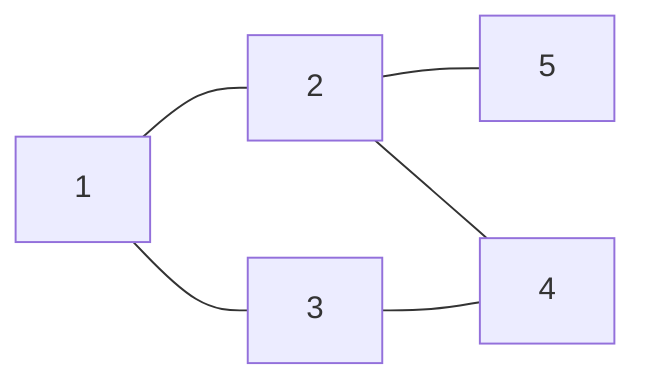
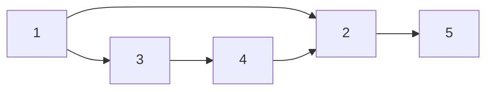
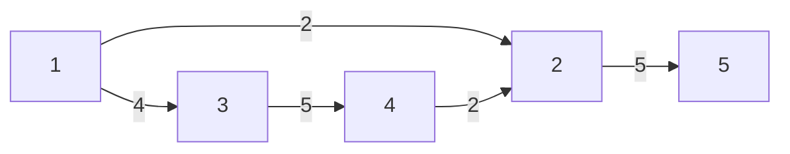

9_1 그래프와 인접행렬

       
 

## 1. 무방향 그래프 

---
  
  |a|b|
  |---|---|
  |1|2|
  |1|3|
  |2|4|
  |3|4|
  |2|5|

---

|-|-|1|2|3|4|5| 
|---|---|---|---|---|---|---|
|-|-|-|-|-|-|-|
|1|-|0|1|1|0|0|
|2|-|1|0|0|1|1|
|3|-|1|0|0|1|0|
|4|-|0|1|0|0|0|
|5|-|0|0|0|0|0|

---

<pre>
💬 방향이 없는 그래프이기때문에 행에서 열로, 열에서 행으로  graph[a][b]= 1; graph[b][a]= 1; 
입력 값 a,b 2차원 배열에 표기해준다. 
</pre>

 
 
 
 
 
 
 
 

## 2. 방향 그래프 

---

|a|b|
|---|---|
|1|2|
|1|3|
|3|4|
|4|2|
|2|5|

---

|-|-|1|2|3|4|5| 
|---|---|---|---|---|---|---|
|-|-|-|-|-|-|-|
|1|-|0|1|1|0|0|
|2|-|0|0|0|0|1|
|3|-|0|0|0|1|0|
|4|-|0|1|0|0|0|
|5|-|0|0|0|0|0|

---

<pre>
💬 방향 있는 그래프이기때문에 행에서 열로만 graph[a][b]= 1; 입력 값 a,b 2차원 배열에 1로 표기해준다. 
</pre>

 
 
 
 
 
 
 
 

## 3. 가중치 방향 그래프

---

|a|b|c|
|---|---|---|
|1|2|2|
|1|3|4|
|3|4|5|
|4|2|2|
|2|5|5|

---

|-|-|1|2|3|4|5| 
|---|---|---|---|---|---|---|
| -|- |- | -|- | -| -|
|1|-|0|2|4|0|0|
|2|-|0|0|0|0|5|
|3|-|0|0|0|5|0|
|4|-|0|2|0|0|0|
|5|-|0|0|0|0|0|

---

<pre>
💬 방향 있는 그래프이기때문에 행에서 열로만 graph[a][b]= c; 입력 값 a,b 2차원 배열에 c로 표기해준다. 
</pre>

